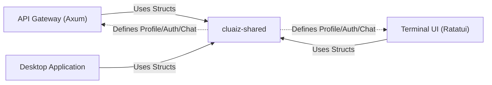

# 🧩 Cluaiz Shared (`shared/`)

<strong>The Sovereign Reusable Core</strong>

---

## 🎯 Deep Purpose

The `shared/` crate acts as the absolute **source of truth** for business logic, data structures, and configuration schemas across the entire Cluaize ecosystem. 

When building a multi-interface architecture—where an HTTP Gateway (`api/`), a local TUI (CLI), a Desktop App, and a Web App all need to interact with the underlying Engine—duplicating struct definitions or authentication logic leads to catastrophic desynchronization. 

This crate solves that by centralizing all structural DNA.

> **Architectural Rule:** `shared` depends on NOTHING in the workspace. Everything else depends on `shared`.

## 🏛️ Architectural Flow

## 🧬 Significant Subsystems

### 1. `profile/` & `onboarding/`
- **The Core Logic:** Defines the exact JSON schemas and Rust structs for user hardware profiles and initial setup states.
- **The "Why":** Ensuring that if a user sets up their hardware profile via the CLI, the HTTP API reads it natively without conversion layers.

### 2. `auth/`
- **The Core Logic:** Implements local authentication mechanisms and Vault access protocols.
- **The "Why":** Security logic must be centralized. By placing it in `shared`, we guarantee that every interface (API, CLI) enforces the exact same cryptographic verification before allowing inference.

### 3. `Chat/`
- **The Core Logic:** Contains the unified structures for Message payloads, Session memory states, and token streaming chunks.
- **The "Why":** The core Engine streams `ChatResponse` chunks. If the CLI and API expect different payload structures, the system crashes. `shared` forces a strict contract.
