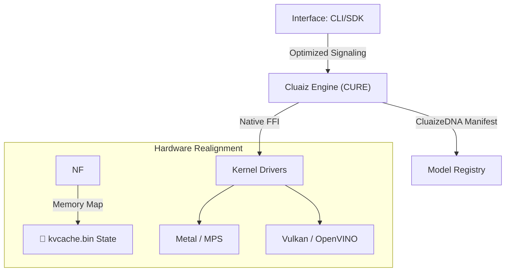

<p align="center">
  
</p>

<h1 align="center">Cluaize</h1>
<h2 align="center">Cluaiz AI Inference Engine (Cluaize): Rust Orchestrator for Local LLMs</h1>

<p align="center">
  <b>High-Performance Rust Runtime & Orchestrator for Local LLMs</b><br>
  <i>Lightweight Rust runtime · Native FFI bindings to llama.cpp · Hardware-aware memory scheduling</i>
</p>

<p align="center">
  
  
  
  
</p>

---

## 🛡️ **Project Trust & Current Status**

> [!WARNING]
> **Active Development Warning**: This project is under active development. You may encounter bugs, performance issues, or breaking changes. During the Alpha phase, we highly recommend cloning the code and building it locally from source rather than relying on binary packages, as pre-compiled binary releases are **coming soon**.

> [!IMPORTANT]
> **Current Phase**: **Industrial Alpha (Research Phase)**.
> Cluaize is an experimental Rust infrastructure for LLM orchestration. While the core architecture is build-stable, hardware-constrained guarantees and specialized ternary kernels are undergoing rigorous validation.
> 
> **Database Integration (`cluaizd`)**:
> Cluaize integrates with the [cluaizd database engine](https://github.com/cluaiz/cluaizd) for persistent memory, DNA, and role-based vector management. For database setup, issues, internal logs, and database schema information, please visit the [cluaizd repository](https://github.com/cluaiz/cluaizd).

### **Current Capabilities**
- ✅ **Shared-Memory Signaling**: Sub-microsecond path for IPC between application and engine.
- ✅ **Modular Handshake**: Dynamic linkage to pre-compiled kernels (Llama, Candle).
- ✅ **Hardware Fingerprinting**: Atomic silicon discovery and profiling.
- ✅ **Cross-Platform Baseline**: Native MSVC/GNU support for Windows and Linux.

### **Research Directions (In Progress)**
- 🧪 **LogitSteer v2** *(Constrained JSON/Schema Decoding Layer)*: Fine-grained structured token masking for reliable schema adherence.
- 🧪 **Ternary Optimizations**: Specialized Addition-Subtraction kernels for BitNet b1.58.
- 🧪 **P2P Universal Sync**: Local context synchronization without cloud dependencies.

---

## 📖 **About Cluaize**

**An open-source, high-performance local AI inference engine.**

Cluaize is a lightweight orchestration layer written in Rust, built on top of the robust `llama.cpp` kernel. It is designed to bridge the gap between high-level applications and low-level hardware execution, providing developers with a streamlined, memory-efficient way to run Large Language Models (LLMs) locally.

### **Our Motive & Objective**
The primary goal of Cluaize is to democratize local AI by making it accessible and stable on everyday hardware. We aim to:
- **Maximize Hardware Efficiency**: Squeeze the best possible performance out of constrained environments (like 4GB VRAM GPUs) using smart, real-time memory arbiters.
- **Provide Seamless Integration**: Offer a simple, modular architecture so developers can easily integrate local AI into their existing applications via our C-API or Rust SDK.
- **Support Modern Architectures**: Ensure out-of-the-box compatibility with the latest AI advancements, such as BitNet (1.58-bit ternary models) and standard GGUF formats.

Cluaize is **NOT** a new AI model, nor a new low-level math kernel—it is a specialized, lightweight engine that sits on top of existing industry-standard inference tools to manage resources intelligently and efficiently.

| Component     | Role         | Implementation                   |
| :------------ | :----------- | :------------------------------- |
| **Engine**    | Orchestrator | Rust-Native Kernel Management    |
| **DNA**       | Manifest     | Unified Identity & Versioning    |
| **LogitSteer** | Steering     | Constrained Decoding & Masking   |
| **Drivers**   | Interface    | Native FFI (CUDA, Metal, Vulkan) |

---

## 🏗️ **Design Principles**

- **Minimize Abstraction Overhead**: Built directly in Rust to keep the runtime footprint small and predictable.
- **Modular Runtime**: Decoupled engine and interface layers for heterogeneous hardware compatibility.
- **Hardware-Aware Execution**: Dynamic kernel selection based on real-time silicon fingerprinting.
- **Reproducible Binary Routing**: Ensuring consistent inference results across platforms via CluaizeDNA.
- **Cross-Platform Portability**: Native execution across Windows, Linux, and Apple Silicon.

---

## 🧭 **Universal Architecture**

Cluaize utilizes a tiered stack to bridge the gap between high-level applications and low-level hardware.

### **Neural Runtime Stack**
```text
Application (CLI / SDK)
      ↓ (Shared-Memory Signaling)
Cluaiz Engine (Orchestrator)
      ↓ (Dynamic Native FFI)
Inference Kernels (Llama.cpp / Candle)
      ↓ (Silicon Drivers)
Hardware (CUDA / Metal / Vulkan)
```

### **The CluaizeDNA standard**
A decoupled, three-tier modular design that ensures zero-drift between the CLI, the Engine, and the bare-metal Drivers.



---

## 📊 **Hardware & Compatibility Matrix**

### **Silicon Backend Matrix**
| Backend      | Vendor    | Acceleration         | Status         |
| :----------- | :-------- | :------------------- | :------------- |
| **CUDA**     | NVIDIA    | Tensor Cores (v12+)  | ✅ Alpha        |
| **Metal**    | Apple     | MPS / Neural Engine  | ✅ Alpha        |
| **Vulkan**   | Universal | Cross-Vendor Compute | ✅ Alpha        |
| **OpenVINO** | Intel     | NPU / iGPU           | 🧪 Experimental |

### **OS Availability**
| OS          | Architecture | Target        | Status    |
| :---------- | :----------- | :------------ | :-------- |
| **Windows** | x86_64       | MSVC Native   | ✅ Alpha   |
| **Linux**   | x86_64       | GNU / Musl    | ✅ Alpha   |
| **macOS**   | ARM64 (M1+)  | Mach-O Native | ✅ Alpha   |
| **Android** | ARM64        | NDK / Neon    | 🧪 Planned |

### **Model Compatibility**
- ✅ **GGUF** (Universal Quantization)
- ✅ **BitNet b1.58** (Ternary Support)
- ✅ **Llama.cpp Kernels**
- ✅ **Candle Backends**

---

## 🛰️ **Routing & Steering**

### ⚙️ **The Control Center: `system_booster.json`**
Cluaize relies on `~/.cluaize/engine/system_booster.json` as its primary configuration gateway, acting as the bridge between user intent and the native VRAM Arbiter. 
This is not just a UI preference file—it dynamically adjusts Rust-level execution logic:

- **`mode_run`**: Defines the active VRAM allocation strategy. For example, `UltraMaxBoost` drops the safe VRAM allocation margin down to `1%` (or an absolute 250MB floor) to maximize context length, while `Balance` mode retains larger margins (~15%) for multitasking stability.
- **`force_vram_reclaim`**: A critical override that enforces an ultra-tight `0.5%` VRAM safety margin. When enabled, the VRAM Arbiter performs live silicon probes (`live_vram_probe`) instead of theoretical math, ensuring absolute maximum kvcache.bin allocation without hitting OS memory spill limits.
- **`flash_attention` & `dflash`**: Directs the engine to pass native FlashAttention kernel flags into the FFI bindings during model load.
- **`think_mode`**: Intercepts output at the Rust orchestration layer. When `"On"`, the engine dynamically watches the token stream for `<think>` boundaries and applies native formatting before stdout.
- **`kv_cache_quantization`**: Modifies the per-element byte allocation in the Arbiter's `Independent MATH` formula, allowing the engine to calculate and fit significantly larger context windows on memory-constrained GPUs (like 4GB).

### **LogitSteer: Token Masking Protocol**
Enforces structural output (JSON/Schema) through **constrained decoding**. By applying token-level masking during the sampling phase, Cluaize prevents structural hallucinations at the hardware layer.

### **Dynamic Kernel Routing**
Maps inference tasks to the appropriate kernel backend based on hardware availability and model type, ensuring consistent performance across CUDA, Metal, and CPU fallback paths.

---

## 🧩 **WASM Skills & Agentic Tool Calling**

Cluaize is not just a text generator; it's a fully Independent Agentic Engine. It can dynamically download, compile, and execute isolated WebAssembly (WASM) skills on your local hardware.

### **How Skills Work Under the Hood**
1. **Semantic Routing (Zero-Delay TTFT)**: When you type a prompt (e.g., `"build a landing page"`), Cluaize's internal vector router checks if you have a skill installed that matches this intent. If found, it instantly merges the skill's instructions into the context window.
2. **Hybrid KV Caching**: Skills contain thousands of tokens. Computing this context on your GPU every time would be too slow. Instead, Cluaize computes a `.kvcache.bin` file once and saves it to your SSD. The next time you use the skill, the Engine bypasses the prompt evaluation phase entirely and performs a native `M-RoPE` (Rotary Positional Embedding) injection of the saved KV cache directly into the GPU's active hardware memory slot.
3. **Agentic Pause (CPU Fallback)**: If a skill's context size (e.g., 8,000 tokens) exceeds your GPU's available VRAM, Cluaize triggers an **Agentic Pause**. It safely offloads the heavy lifting to your CPU and System RAM to calculate the cache in the background without crashing your GPU or hitting Out-of-Memory (OOM) limits.
4. **WASM Sandboxing**: When the AI decides to execute a skill's code (e.g., formatting output or generating code), it runs inside a strict WASM sandbox, ensuring complete security and isolation from your host OS.

### **Managing Skills via CLI**
You can seamlessly install, manage, and clean up skills using the built-in `skill` command suite. 
Browse the official **<a href="https://github.com/cluaiz/skills" target="_blank">Cluaize Skills Registry</a>** to find available skills.

```bash
# Install a new skill by name
$ cluaize skill install <skill_name>

# List all actively installed skills on your machine
$ cluaize skill list

# View all generated KV Caches stored on your SSD
$ cluaize skill cache ls

# Delete the KV cache for a specific model (e.g., if a cache gets corrupted or needs a fresh rebuild)
$ cluaize skill cache clear <model_id>

# Delete ALL orphaned KV caches globally across all skills to free up SSD space
$ cluaize skill cache clear --all
```

---

## 📊 **Benchmarking & Comparison**

### **Performance Snapshot**
*Measured on AMD Ryzen 7 7435HS + NVIDIA RTX 3050.*

| Metric                | Cluaize (Alpha)      |
| :-------------------- | :------------------ |
| **Signaling Latency** | **Sub-microsecond** |
| **Memory Footprint**  | **~25MB**           |
| **Startup Time**      | **~150ms**          |

> **Real-world benchmarks are the only honest comparison.** See the Hardware Benchmark table below for measured TPS, VRAM usage, and power draw on actual hardware.

---

## 🛡️ **Security Architecture**

- **Process Isolation**: Kernels execute in restricted sub-processes with OS-level sandboxing (Job Objects on Windows, Namespaces on Linux).
- **VRAM Arbiter**: Real-time memory governor tracks allocation and performs LRU eviction to prevent OOM errors.
- **DNA Verification**: SHA-256 manifest verification for all binary kernels before dynamic linkage.

---

## 📂 **Repository Structure**

```text
/Apps
  /cli            # CLI (User Interface)
/inference-engine
  /api            # Low-latency C-API Handshake
  /engines        # Core Orchestration Runtime (CURE)
    /cluaize-shared # Unified System DNA & Types
    /system-booster # Hardware Governor & Memory Arbiter
/inference-drivers
  /drivers        # Native Kernel Binary Mapping
  /registry.json  # Global Hardware-to-Backend registry
/interface-engines # Specialized Inference Wrappers (Llama, Candle)
```

---

## 🚀 **Roadmap & Versioning**

- **v0.1-dev-release (Alpha)** (Current): Core shared-memory signaling, **Dynamic Model Mapping**, Hardware-Aware Arbiter, and **Thinking Mode** optimized runtime.
- **v0.2 Runtime Probe**: LogitSteer v2 integration and automated kernel provisioning.
- **v0.3 Distributed Scheduler**: Distributed inference across local nodes (P2P).

---

## ⚡ **Hardware & Performance Troubleshooting**

Cluaize pushes hardware to its absolute mathematical limits. If you experience unexpected performance drops (e.g., TPS falling from 50 to 15), check the following native constraints:

### 1. **Laptop Power-Saving Throttling (The 10W vs 30W Rule)**
Modern GPUs (like the RTX 3050 Laptop GPU) require adequate wattage for optimal tensor processing. 
* **Observation:** If your battery drops to ~10% and is unplugged, Windows OS automatically forces the GPU into **Whisper Mode / Battery Saver**. The GPU will draw only **~10W**, dropping your TPS to ~15-17.
* **Fix:** Plug in your laptop charger. The GPU will immediately scale up to **~30W - 33W**, pushing your speed back up to 33+ TPS.


### 2. **Context Window vs Memory Bandwidth**
Unlike cloud APIs, local inference speed is bound by physical **Memory Bandwidth (GB/s)**. 
* A 5,000 token context window is small and blazingly fast to compute.
* A massive 20,000 token context window requires the GPU to read over 2.5GB of KV Cache over the bus *for every single word generated*.
* **Impact:** Extreme context windows inherently reduce TPS due to PCIe/VRAM bandwidth physical limits.

### 3. **The "PCIe Spill" Phenomenon (Shared Memory)**
Cluaize uses a dynamic VRAM Arbiter to negotiate memory. If the engine pushes too close to the physical 100% VRAM limit (e.g., allocating 3.9GB on a 4GB card), the Windows Desktop Window Manager (DWM) will forcefully evict part of the KV Cache into **Shared GPU Memory (System RAM)**.
* **Impact:** System RAM is 30x slower than VRAM. Even a tiny 0.2GB spill will force the GPU to fetch cache over the PCIe cable, crashing TPS from 50 to 15.
* **Fix:** Cluaize applies a strict **7.5% Safe VRAM Allocation Margin** (~300MB) to give the OS breathing room and completely prevent PCIe spilling.

---

## 🕹️ **Quick Start Manual**
### 📊 **Local Hardware Benchmark**

For a fully exhaustive, automated hardware-wise benchmark across all models (where BitNet architectures achieve up to ~50 TPS with 0.05s TTFT), see the [Detailed Hardware Benchmark Report](test/benchmark/README.mdx).

*Quick manual snapshot measured on an **RTX 3050 (Laptop)**:*

| **Metric**         | **Bonsai1 8B** | **Gemma 4B** | **Gemma 2B**  | **Qwen 4B**  | **Qwen 2B**  |
| :----------------- | :------------- | :----------- | :------------ | :----------- | :----------- |
| **Speed (TPS)**    | 48.6           | 19.4         | 31.6          | 21.2         | 32.7         |
| **TTFT (s)**       | 0.05s          | 0.08s        | 0.06s         | 0.08s        | 0.05s        |
| **Total Time (s)** | ~39.3s         | ~53.5s       | ~46.4s        | ~90.2s       | ~62.6s       |
| **Tokens Out**     | 1911           | 1038         | 1465          | 1913         | 2048         |
| **Reasoning Mode** | Deep Thinking  | Deep Thinking| Deep Thinking | Deep Thinking| Deep Thinking|
| **Memory (VRAM)**  | 2.82 GB        | ~2.5 GB      | 1.90 GB       | ~2.6 GB      | ~1.8 GB      |
| **Power Used**     | ~52W           | ~45W         | ~31W          | ~45W         | ~35W         |
| **Privacy**        | 100% Offline   | 100% Offline | 100% Offline  | 100% Offline | 100% Offline |

> [!NOTE]
> Cluaize provides a **lightweight Rust runtime for llama.cpp**, designed to minimize system RAM overhead and prevent OOM crashes on 4GB VRAM setups. Inference is handled by llama.cpp under the hood — Cluaize's value is in smarter orchestration.

🚀 Remote Power-On Installation (Recommended)

Get the entire Cluaize runtime compiled, linked, and calibrated natively with a single command:

#### **Windows (PowerShell)**:
```powershell
powershell -ExecutionPolicy Bypass -Command "iwr -useb https://raw.githubusercontent.com/cluaize/cluaize/main/install.ps1 | iex"
```

#### **Linux & macOS (Shell)**:
```bash
curl -fsSL https://raw.githubusercontent.com/cluaize/cluaize/main/install.sh | bash
```

---

### 🛠️ Local Compilation (Manual Build)

If you prefer to compile from source, you can build the entire workspace natively using Cargo:

```bash
# 1. Clone the repository
$ git clone https://github.com/cluaiz/cluaize.git
$ cd cluaize

# 2. Build the entire Cluaize: Rust Orchestrator for Local LLMs
$ cargo build --release --workspace

# 3. Run the CLI binary directly from Cargo
$ cargo run -p cli
```

---

### 🕹️ Operational Workflow (How to Use)

Cluaize provides an ultra-low-overhead CLI command suite:

#### **1. Launch the Interactive TUI Dashboard**
Run the naked `cluaize` command to launch our full-terminal interactive control panel (replaces heavy UI web interfaces):
```bash
$ cluaize
```

#### **2. Direct Headless Inference**

Run any locally cached model by name:
```bash
$ cluaize run gemma2:2b
```

Or pass a full **HuggingFace repo ID** — Cluaize will automatically download the GGUF weights and run inference:
```bash
# Using the compiled binary
$ cluaize run Qwen/Qwen3-VL-2B-Instruct-GGUF

# Or directly from source (dev mode)
$ cargo run -p cli -- run Qwen/Qwen3-VL-2B-Instruct-GGUF
```

> [!NOTE]
> HuggingFace downloads are handled natively. Cluaize fetches GGUF weights directly over HTTPS and caches them under `~/.cluaize/models/`.

#### **3. Re-Calibrate Hardware Profile**
Perform real-time RDTSC hardware clocking, SIMD profiling, and VRAM detection to update your native hardware profile:
```bash
$ cluaize --calibrate
```

#### **4. Run Dynamic Hardware Benchmark Suite**
Stress-test your local CPU/GPU subsystems to measure neural operations per second. 
The system automatically limits complex prompts on smaller models (Aukat Filter) and saves hardware-aware reports to `test/benchmark/<hardware>/<model>/`.

```bash
# Run full suite across all downloaded models
$ cluaize benchmark

# Run benchmark on a specific model with 3 iterations (to average out thermal throttling)
$ cluaize benchmark bonsai1-8b --runs 3
```

#### **5. In-Chat Interactive Control Menu (`@`)**
While running the interactive TUI dashboard (`$ cluaize`), simply type **`@`** (and press Enter) to open the **Live Action Menu**. 
This gives you instant, zero-restart control over the core engine:
- **🧠 Switch Model**: Hot-swap your active LLM directly from VRAM without restarting the terminal.
- **⚡ Engine Modes**: Quickly toggle macro presets (e.g., Flash Mode for speed, Think Mode for CoT reasoning).
- **🚀 System Booster**: Access the granular `system_booster.json` configuration natively. Change hardware compute targets (GPU/CPU layers), adjust KV Cache Quantization, toggle Flash Attention, and tweak Context Shifting behavior **live**—the engine will automatically hot-reload the changes.

#### **6. Mid-Generation Pivot (Hot-Steering)**
If the AI is generating a long response (or is deep in `Think Mode`), you can interrupt it at any time by pressing **`Ctrl+C`**. 
Instead of killing the process and losing your VRAM context, Cluaize instantly **Pauses** the engine. You will be prompted to enter a **mid-way instruction** (e.g., *"Make it shorter"* or *"Skip the reasoning, just write the code"*). The engine processes this pivot and continues the exact same generation seamlessly from where it left off without starting over, saving massive amounts of compute and time.

---

### 🛡️ Note on Windows SmartScreen Warning

Since the pre-compiled `cluaize` executables are built dynamically on GitHub Actions and are not signed with a commercial Microsoft code-signing certificate (which requires corporate entity validation), Windows Defender may show a blue **"Windows protected your PC"** pop-up upon double-clicking the app:

**Option 1 (Quick Bypass):**
1. Click on **"More info"** on the pop-up.
2. Click **"Run anyway"** to launch the native CLI dashboard instantly.

**Option 2 (Self-Signing Trick):**
If you want to permanently bypass the unverified prompt, you can use PowerShell to create a manual, hand-made Self-Signed Certificate and sign the `cluaize.exe` binary yourself. This establishes a trusted signature on your local machine.

```powershell
# Run in PowerShell as Administrator
$cert = New-SelfSignedCertificate -DnsName "cluaize-local" -CertStoreLocation "cert:\LocalMachine\My" -Type CodeSigningCert
Set-AuthenticodeSignature -FilePath ".\cluaize.exe" -Certificate $cert
```
 

## Star History

<a href="https://www.star-history.com/?repos=Cluaiz%2Fcluaize&type=date&legend=top-left">
 <picture>
   <source media="(prefers-color-scheme: dark)" srcset="https://api.star-history.com/chart?repos=Cluaiz/cluaize&type=date&theme=dark&legend=top-left" />
   <source media="(prefers-color-scheme: light)" srcset="https://api.star-history.com/chart?repos=Cluaiz/cluaize&type=date&legend=top-left" />
   
 </picture>
</a>

## 📜 **License & Legal**

Cluaize is released under the **Apache License 2.0**.
See the [LICENSE](LICENSE) file for more details.

---

<p align="center">
  <b>© 2026 Cluaiz Technologies. Open-Sourced under Apache 2.0.</b><br>
 </p>