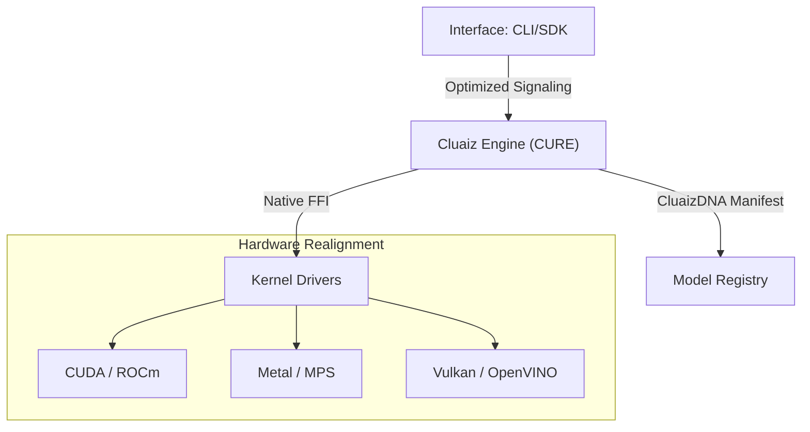

<p align="center">
  
</p>

<h1 align="center">Cluaiz Neural Ecosystem</h1>

<p align="center">
  <b>High-Performance Rust Runtime & Orchestrator for Local LLMs</b><br>
  <i>Lightweight Rust runtime · Native FFI bindings to llama.cpp · Hardware-aware memory scheduling</i>
</p>

<p align="center">
  
  
  
  
</p>

---

## 🛡️ **Project Trust & Current Status**

> [!IMPORTANT]
> **Current Phase**: **Industrial Alpha (Research Phase)**.
> Cluaiz is an experimental neural infrastructure. While the core architecture is build-stable, hardware-constrained guarantees and specialized ternary kernels are undergoing rigorous validation.

### **Current Capabilities**
- ✅ **Shared-Memory Signaling**: Sub-microsecond path for IPC between application and engine.
- ✅ **Modular Handshake**: Dynamic linkage to pre-compiled kernels (Llama, Candle).
- ✅ **Hardware Fingerprinting**: Atomic silicon discovery and profiling.
- ✅ **Cross-Platform Baseline**: Native MSVC/GNU support for Windows and Linux.

### **Research Directions (In Progress)**
- 🧪 **AtmaSteer v2** *(Constrained JSON/Schema Decoding Layer)*: Fine-grained structured token masking for reliable schema adherence.
- 🧪 **Ternary Optimizations**: Specialized Addition-Subtraction kernels for BitNet b1.58.
- 🧪 **P2P Universal Sync**: Local context synchronization without cloud dependencies.

---

## 🧭 **What is Cluaiz? (The Infrastructure Layer)**

Cluaiz is a **lightweight local inference runtime written in Rust** that manages model orchestration, memory scheduling, and native FFI bindings built on top of llama.cpp primitives. It is **NOT** an AI model — it is the orchestration layer that sits between your application and the llama.cpp inference kernel.

| Component     | Role         | Implementation                   |
| :------------ | :----------- | :------------------------------- |
| **Engine**    | Orchestrator | Rust-Native Kernel Management    |
| **DNA**       | Manifest     | Unified Identity & Versioning    |
| **AtmaSteer** | Steering     | Constrained Decoding & Masking   |
| **Drivers**   | Interface    | Native FFI (CUDA, Metal, Vulkan) |

---

## 🏗️ **Design Principles**

- **Minimize Abstraction Overhead**: Bypassing heavy middleware (Docker, Python, Node) to keep the runtime footprint small and predictable.
- **Modular Runtime**: Decoupled engine and interface layers for heterogeneous hardware compatibility.
- **Hardware-Aware Execution**: Dynamic kernel selection based on real-time silicon fingerprinting.
- **Reproducible Binary Routing**: Ensuring consistent inference results across platforms via CluaizDNA.
- **Cross-Platform Portability**: Native execution across Windows, Linux, and Apple Silicon.

---

## 🧭 **Universal Architecture**

Cluaiz utilizes a tiered stack to bridge the gap between high-level applications and low-level hardware.

### **Neural Runtime Stack**
```text
Application (CLI / SDK)
      ↓ (Shared-Memory Signaling)
Cluaiz Engine (Orchestrator)
      ↓ (Dynamic Native FFI)
Inference Kernels (Llama.cpp / Candle)
      ↓ (Silicon Drivers)
Hardware (CUDA / Metal / Vulkan)
```

### **The CluaizDNA standard**
A decoupled, three-tier modular design that ensures zero-drift between the CLI, the Engine, and the bare-metal Drivers.



---

## 📊 **Hardware & Compatibility Matrix**

### **Silicon Backend Matrix**
| Backend      | Vendor    | Acceleration         | Status         |
| :----------- | :-------- | :------------------- | :------------- |
| **CUDA**     | NVIDIA    | Tensor Cores (v12+)  | ✅ Alpha        |
| **Metal**    | Apple     | MPS / Neural Engine  | ✅ Alpha        |
| **Vulkan**   | Universal | Cross-Vendor Compute | ✅ Alpha        |
| **OpenVINO** | Intel     | NPU / iGPU           | 🧪 Experimental |

### **OS Availability**
| OS          | Architecture | Target        | Status    |
| :---------- | :----------- | :------------ | :-------- |
| **Windows** | x86_64       | MSVC Native   | ✅ Alpha   |
| **Linux**   | x86_64       | GNU / Musl    | ✅ Alpha   |
| **macOS**   | ARM64 (M1+)  | Mach-O Native | ✅ Alpha   |
| **Android** | ARM64        | NDK / Neon    | 🧪 Planned |

### **Model Compatibility**
- ✅ **GGUF** (Universal Quantization)
- ✅ **BitNet b1.58** (Ternary Support)
- ✅ **Llama.cpp Kernels**
- ✅ **Candle Backends**

---

## 🛰️ **Routing & Steering**

### **AtmaSteer: Token Masking Protocol**
Enforces structural output (JSON/Schema) through **constrained decoding**. By applying token-level masking during the sampling phase, Cluaiz prevents structural hallucinations at the hardware layer.

### **Dynamic Kernel Routing**
Maps inference tasks to the appropriate kernel backend based on hardware availability and model type, ensuring consistent performance across CUDA, Metal, and CPU fallback paths.

---

## 📊 **Benchmarking & Comparison**

### **Performance Snapshot**
*Measured on AMD Ryzen 7 7435HS + NVIDIA RTX 3050.*

| Metric                | Cluaiz (Alpha)      | Standard Middleware |
| :-------------------- | :------------------ | :------------------ |
| **Signaling Latency** | **Sub-microsecond** | ~20ms - 50ms        |
| **Memory Footprint**  | **~25MB**           | ~800MB (Docker)     |
| **Startup Time**      | **~150ms**          | ~2.5s - 5s          |

> **Real-world benchmarks are the only honest comparison.** See the Sovereign Benchmark table below for measured TPS, VRAM usage, and power draw on actual hardware.

---

## 🛡️ **Security Architecture**

- **Process Isolation**: Kernels execute in restricted sub-processes with OS-level sandboxing (Job Objects on Windows, Namespaces on Linux).
- **VRAM Arbiter**: Real-time memory governor tracks allocation and performs LRU eviction to prevent OOM errors.
- **DNA Verification**: SHA-256 manifest verification for all binary kernels before dynamic linkage.

---

## 📂 **Repository Structure**

```text
/Apps
  /cli            # Industrial CLI (User Interface)
/cluaiz-engine
  /api            # Low-latency C-API Handshake
  /engines        # Core Orchestration Runtime (CURE)
    /cluaiz-shared # Unified System DNA & Types
    /system-booster # Hardware Governor & Memory Arbiter
/inference-drivers
  /drivers        # Native Kernel Binary Mapping
  /registry.json  # Global Hardware-to-Backend registry
/interface-engines # Specialized Inference Wrappers (Llama, Candle)
```

---

## 🚀 **Roadmap & Versioning**

- **v0.1-dev-release (Alpha)** (Current): Core shared-memory signaling, **Dynamic DNA Negotiation**, Hardware-Aware Arbiter, and **Thinking Mode** optimized runtime.
- **v0.2 Runtime Probe**: AtmaSteer v2 integration and automated kernel provisioning.
- **v0.3 Distributed Scheduler**: Distributed inference across local nodes (P2P).

---

## ⚡ **Hardware & Performance Troubleshooting**

Cluaiz pushes hardware to its absolute mathematical limits. If you experience unexpected performance drops (e.g., TPS falling from 50 to 15), check the following native constraints:

### 1. **Laptop Power-Saving Throttling (The 10W vs 30W Rule)**
Modern GPUs (like the RTX 3050 Laptop GPU) require adequate wattage for optimal tensor processing. 
* **Observation:** If your battery drops to ~10% and is unplugged, Windows OS automatically forces the GPU into **Whisper Mode / Battery Saver**. The GPU will draw only **~10W**, dropping your TPS to ~15-17.
* **Fix:** Plug in your laptop charger. The GPU will immediately scale up to **~30W - 33W**, pushing your speed back up to 33+ TPS.


### 2. **Context Window vs Memory Bandwidth**
Unlike cloud APIs, local inference speed is bound by physical **Memory Bandwidth (GB/s)**. 
* A 5,000 token context window is small and blazingly fast to compute.
* A massive 20,000 token context window requires the GPU to read over 2.5GB of KV Cache over the bus *for every single word generated*.
* **Impact:** Extreme context windows inherently reduce TPS due to PCIe/VRAM bandwidth physical limits.

### 3. **The "PCIe Spill" Phenomenon (Shared Memory)**
Cluaiz uses a dynamic VRAM Arbiter to negotiate memory. If the engine pushes too close to the physical 100% VRAM limit (e.g., allocating 3.9GB on a 4GB card), the Windows Desktop Window Manager (DWM) will forcefully evict part of the KV Cache into **Shared GPU Memory (System RAM)**.
* **Impact:** System RAM is 30x slower than VRAM. Even a tiny 0.2GB spill will force the GPU to fetch cache over the PCIe cable, crashing TPS from 50 to 15.
* **Fix:** Cluaiz applies a strict **7.5% Safe VRAM Allocation Margin** (~300MB) to give the OS breathing room and completely prevent PCIe spilling.

---

## 🕹️ **Quick Start Manual**

### 📊 **Local Hardware Benchmark**

All tests performed on an **RTX 3050 (Laptop)** using the prompt: *"What is Local AI and why is it important?"*

| **Metric**         | **Bonsai1 8B** | **Gemma 4B** | **Gemma 2B**  | **Qwen 4B**  | **Qwen 2B**  |
| :----------------- | :------------- | :----------- | :------------ | :----------- | :----------- |
| **Speed (TPS)**    | 48.6           | TBD          | 31.6          | TBD          | TBD          |
| **Tokens Out**     | 1911           | TBD          | 1465          | TBD          | TBD          |
| **Reasoning Mode** | Deep Thinking  | Standard     | Deep Thinking | Standard     | Standard     |
| **Memory (VRAM)**  | 2.82 GB        | TBD          | 1.90 GB       | TBD          | TBD          |
| **Power Used**     | ~52W           | TBD          | ~31W          | TBD          | TBD          |
| **Privacy**        | 100% Offline   | 100% Offline | 100% Offline  | 100% Offline | 100% Offline |

> [!NOTE]
> Cluaiz bypasses heavy Python/Docker environments to provide a **lightweight Rust runtime for llama.cpp**, minimizing system RAM overhead and preventing OOM crashes on 4GB VRAM setups. Inference is handled by llama.cpp under the hood — Cluaiz's value is in smarter orchestration, not a different kernel.

🚀 Remote Power-On Installation (Recommended)

Get the entire sovereign neural runtime compiled, linked, and calibrated natively with a single command:

#### **Windows (PowerShell)**:
```powershell
powershell -ExecutionPolicy Bypass -Command "iwr -useb https://raw.githubusercontent.com/cluaiz/cluaiz/main/install.ps1 | iex"
```

#### **Linux & macOS (Shell)**:
```bash
curl -fsSL https://raw.githubusercontent.com/cluaiz/cluaiz/main/install.sh | bash
```

---

### 🛠️ Local Compilation (Manual Build)

If you prefer to compile from source, you can build the entire workspace natively using Cargo:

```bash
# 1. Clone the repository
$ git clone https://github.com/cluaiz/cluaiz.git
$ cd cluaiz

# 2. Build the entire Cluaiz Neural Ecosystem
$ cargo build --release --workspace

# 3. Run the CLI binary directly from Cargo
$ cargo run -p cli
```

---

### 🕹️ Operational Workflow (How to Use)

Cluaiz provides an ultra-low-overhead CLI command suite:

#### **1. Launch the Sovereign Interactive TUI Dashboard**
Run the naked `cluaiz` command to launch our full-terminal interactive control panel (replaces heavy UI web interfaces):
```bash
$ cluaiz
```

#### **2. Direct Headless Inference**

Run any locally cached model by name:
```bash
$ cluaiz run gemma2:2b
```

Or pass a full **HuggingFace repo ID** — Cluaiz will automatically download the GGUF weights and run inference:
```bash
# Using the compiled binary
$ cluaiz run Qwen/Qwen3-VL-2B-Instruct-GGUF

# Or directly from source (dev mode)
$ cargo run -p cli -- run Qwen/Qwen3-VL-2B-Instruct-GGUF
```

> [!NOTE]
> HuggingFace downloads are handled natively without Python or `huggingface-cli`. Cluaiz fetches GGUF weights directly over HTTPS and caches them under `~/.cluaiz/models/`.

#### **3. Re-Calibrate Hardware Profile**
Perform real-time RDTSC hardware clocking, SIMD profiling, and VRAM detection to update your native hardware profile:
```bash
$ cluaiz --calibrate
```

#### **4. Run Dynamic Hardware Benchmark Suite**
Stress-test your local CPU/GPU subsystems to measure neural operations per second. 
The system automatically limits complex prompts on smaller models (Aukat Filter) and saves hardware-aware reports to `test/benchmark/<hardware>/<model>/`.

```bash
# Run full suite across all downloaded models
$ cluaiz benchmark

# Run benchmark on a specific model with 3 iterations (to average out thermal throttling)
$ cluaiz benchmark bonsai1-8b --runs 3
```

---

### 🛡️ Note on Windows SmartScreen Warning

Since the pre-compiled `cluaiz` executables are built dynamically on GitHub Actions and are not signed with a commercial Microsoft code-signing certificate (which requires corporate entity validation), Windows Defender may show a blue **"Windows protected your PC"** pop-up upon double-clicking the app:

**Option 1 (Quick Bypass):**
1. Click on **"More info"** on the pop-up.
2. Click **"Run anyway"** to launch the native CLI dashboard instantly.

**Option 2 (Self-Signing Trick):**
If you want to permanently bypass the unverified prompt, you can use PowerShell to create a manual, hand-made Self-Signed Certificate and sign the `cluaiz.exe` binary yourself. This establishes a trusted signature on your local machine.

```powershell
# Run in PowerShell as Administrator
$cert = New-SelfSignedCertificate -DnsName "cluaiz-local" -CertStoreLocation "cert:\LocalMachine\My" -Type CodeSigningCert
Set-AuthenticodeSignature -FilePath ".\cluaiz.exe" -Certificate $cert
```

---

## 📜 **License & Legal**

Cluaiz is released under the **Apache License 2.0**.
See the [LICENSE](LICENSE) file for more details.

---

<p align="center">
  <b>© 2026 Cluaiz Technologies. Open-Sourced under Apache 2.0.</b><br>
 </p>