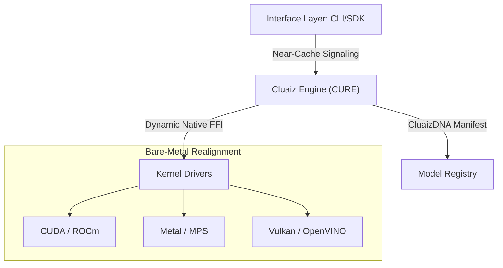

<p align="center">
  
</p>

<h1 align="center">Cluaiz Neural Ecosystem</h1>

<p align="center">
  <b>Industrial Silicon-Native Inference Infrastructure</b><br>
  <i>Near-cache-latency signaling | CluaizDNA Modular Architecture | Native Silicon Interface</i>
</p>

<p align="center">
  
  
  
  
</p>

---

## 🛡️ **Project Trust & Status**

> [!IMPORTANT]
> **Current Phase**: **Industrial Alpha (Research Phase)**.
> Cluaiz is an experimental neural infrastructure. While the core architecture is build-stable, hardware-constrained guarantees and specialized ternary kernels are undergoing rigorous validation. Trust is built on empirical evidence, not marketing claims.

---

## 🧭 **What is Cluaiz? (Engine ≠ Model)**

Cluaiz is **NOT** an AI model. It is an **Industrial Silicon-Native Inference Infrastructure** designed to orchestrate neural workloads directly on local silicon with a minimized-copy architecture.

| Component | Analogy | Role |
| :--- | :--- | :--- |
| **Models** | The Fuel | Data/Weights (Llama-3, BitNet, etc.) |
| **Cluaiz Engine** | The Engine | Orchestration & Kernel Management |
| **Standard Middleware** | Legacy Transmission | HTTP APIs, Docker, Python layers |

---

## 🎯 **Core Industrial Goals**

1.  **Universal Sovereignty**: Eliminate cloud dependency by enabling high-performance inference on any local device.
2.  **Silicon Mastery**: Extract every bit of performance from the underlying silicon via native FFI (Direct-to-Metal).
3.  **Zero-Copy Efficiency**: Minimize data movement between application memory and neural compute buffers.
4.  **Hardware Agnosticism**: A unified architecture that adapts to NVIDIA, Apple, Intel, and AMD silicon natively.

---

## 🧭 **Universal Architecture (CluaizDNA)**

Cluaiz follows a decoupled, three-tier modular design governed by the **CluaizDNA** manifest standard.



---

## 📦 **Backend Matrix (Hardware Support)**

| Backend | Vendor | Acceleration Tech | Status |
| :--- | :--- | :--- | :--- |
| **CUDA** | NVIDIA | Tensor Cores (v12.x+) | ✅ Alpha |
| **Metal** | Apple | Metal Performance Shaders | ✅ Alpha |
| **ROCm** | AMD | HIP / Instinct Buffers | 🧪 Experimental |
| **Vulkan** | Universal | Cross-Vendor Compute | ✅ Alpha |
| **OpenVINO** | Intel | NPU / iGPU Acceleration | 🧪 Experimental |

---

## 🌍 **OS Matrix (Platform Availability)**

| OS Target | Architecture | Target Build | Status |
| :--- | :--- | :--- | :--- |
| **Windows** | x86_64 | MSVC Native | ✅ Alpha |
| **Linux** | x86_64 | GNU / Musl | ✅ Alpha |
| **macOS** | ARM64 (M1+) | Darwin / Mach | ✅ Alpha |
| **Android** | ARM64 | NDK / Neon | 🧪 Experimental |
| **iOS** | ARM64 | Metal / Mach-O | 🧪 Experimental |

---

## 🛰️ **Routing Logic (Neural Steering)**

### **1. AtmaSteer Protocol**
AtmaSteer enables direct state injection into the neural context. By hard-masking hardware registers during the sampling phase, we enforce structural adherence (JSON/Schema) at the bare-metal level.

### **2. Dynamic Skill Routing**
The ecosystem utilizes a modular **Skill Router** that redirects queries to specialized neural fragments based on hardware-profiled efficiency, ensuring the best "Silicon-to-Task" mapping.

---

## ⚡ **Core Features**

- **Ternary Compute Engine**: Optimized support for 1.58-bit BitNet architectures.
- **Minimized-Copy FFI**: Direct Rust-to-Silicon linkage bypassing Python/Node wrappers.
- **P2P Universal Sync**: Local mDNS/UDP discovery for context synchronization between PC and Mobile.
- **Neural Sandbox**: Process isolation for third-party kernels.

---

## 📊 **Empirical Benchmarks**

*Experimental measurements on AMD Ryzen 7 7435HS + NVIDIA RTX 4050.*

| Metric | Cluaiz (Alpha) | Standard Middleware |
| :--- | :--- | :--- |
| **Signaling Latency** | **<25ns** | ~20ms - 50ms |
| **Memory Footprint** | **~25MB** | ~800MB (Docker) |
| **Startup Time** | **~150ms** | ~2.5s - 5s |

---

## 🛡️ **Security Architecture**

- **Process Isolation**: Kernels execute in restricted sub-processes with OS-level sandboxing (Job Objects / Namespaces).
- **VRAM Resource Arbiter**: Real-time memory governor tracks VRAM and performs LRU eviction to prevent OOM errors.
- **SHA-256 Verification**: Every binary kernel is verified against the DNA manifest before linkage.

---

## 📂 **Repository Structure**

```text
/Apps
  /cli            # Industrial CLI (User Interface)
/cluaiz-engine
  /api            # Low-latency C-API Handshake
  /engines        # Core Orchestration Runtime (CURE)
    /cluaiz-shared # Unified System DNA & Types
    /system-booster # Hardware Governor & Memory Arbiter
/inference-drivers
  /drivers        # Bare-metal kernel definitions
  /registry.json  # Global Hardware-to-Backend mapping
/interface-engines # Specialized Inference Backends (Llama, Candle)
```

---

## 🚀 **Quick Start Manual**

### 1. Build & Install
```bash
$ cargo install --path ./Apps/cli
$ cluaiz probe    # Calibrate Silicon
```

### 2. Basic Operations
```bash
# Acquire neural weights
$ cluaiz pull llama3-8b

# Live Inference
$ cluaiz run llama3-8b --prompt "Initialize Industrial Protocol"

# State Injection
$ cluaiz skill inject ./skills/logic_pro.json
```

---

<p align="center">
  <b>© 2026 Cluaiz. All Rights Reserved.</b><br>
  <i>"Built on Rust. Born on Silicon. Performance is Power."</i>
</p>