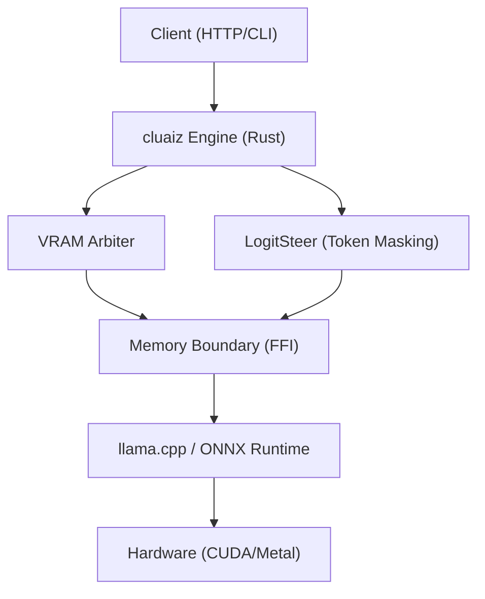

<p align="center">
  
</p>

<div align="center">

<span><strong><font size="7">Cluaiz</font></strong></span><br>
<span><strong><font size="5">Build. Run. Extend. Local AI.</font></strong></span><br>
<strong>One platform. One runtime. Built for modern local AI.</strong><br>
<sub>Unified runtime for building, running, and extending AI applications.</sub>
</div>
<br>
<p align="center">
  
  
  
  
</p>

---

## 🛡️ **Project Trust & Current Status**

> [!WARNING]
> **Active Development**: This project is under active development. You may encounter bugs or breaking changes. Pre-compiled binary releases are **coming soon**.
>
> **Current Phase**: **Industrial Alpha (Research Phase)**.
> While the core orchestration architecture is stable, hardware-constrained guarantees and ternary kernels are undergoing validation.

## 📖 What is Cluaiz?

Cluaiz is an open-source local AI runtime designed to simplify how developers build, run, and extend local AI applications.

Instead of combining multiple runtimes, model backends, scripts, and external tools, Cluaiz provides a unified runtime that brings them together through one consistent developer experience.

The current alpha focuses on reliable local inference, runtime orchestration, and a modular architecture. Additional capabilities such as plugins, skills, MCP integration, and the Cluaiz Hub are being developed incrementally as the platform evolves.

Cluaiz is built with Rust and currently integrates `llama.cpp` for language models and `ONNX Runtime` for vision and embedding workloads, providing a consistent foundation for local AI development.

---

## 💡 Why Cluaiz?

Building local AI applications often requires combining multiple tools, runtimes, libraries, and custom integrations. This increases setup complexity, maintenance effort, and long-term project overhead.

Cluaiz aims to reduce that complexity by providing a unified runtime where local AI components can work together through a consistent architecture.

Rather than replacing existing open-source projects, Cluaiz focuses on making them easier to integrate, manage, and extend as part of a single local AI platform.

The long-term vision is to provide a cohesive foundation for building, running, and extending local AI applications while keeping developers in control of their models, workflows, and data.

## 🚀 **Quick Start**

Start chatting instantly. No setup required. cluaiz handles all GGUF downloads and hardware compilation natively.

### 1. Install cluaiz

**Windows (PowerShell)**

```powershell
powershell -ExecutionPolicy Bypass -Command "iwr -useb https://raw.githubusercontent.com/cluaiz/cluaiz/main/install.ps1 | iex"
```

**Linux & macOS (Shell)**

```bash
curl -fsSL https://raw.githubusercontent.com/cluaiz/cluaiz/main/install.sh | bash
```

### 2. Launch the Interactive TUI Dashboard

Run the naked `cluaiz` command to launch our full-terminal interactive control panel:

```bash
cluaiz
```

### 3. Start the Background API Server

Run the background daemon to serve models via the OpenAI-compatible REST API:

```bash
cluaiz serve
```

> [!TIP]
> **Pure Client Auto-Detection**: If you start `cluaiz serve` in the background, and then run the `cluaiz` dashboard in another terminal, the dashboard will automatically detect the running server and connect to it as a **Pure Client**. It will skip loading a duplicate engine locally, saving 100% of your VRAM!

### 4. Direct Headless Inference

Run any locally cached model by name:

```bash
cluaiz run gemma2:2b
```

Or pass a full **HuggingFace repo ID** — cluaiz will automatically download the GGUF weights and run inference:

```bash
# Syntax
$ cluaiz run <id>

# Example
$ cluaiz run Qwen/Qwen3-VL-2B-Instruct-GGUF
```

> [!NOTE]
> HuggingFace downloads are handled natively. cluaiz fetches GGUF weights directly over HTTPS and caches them under `~/.cluaiz/models/`.

### 5. Install Skills & Plugins Natively

Extend the AI's capabilities natively:

```bash
# Install a new skill by name
$ cluaiz skill install github-assistant

# Install a plugin
$ cluaiz plugin install web-scraper
```

---

## 📚 **Deep Documentation Reference**

<details>
<summary><b>Click to expand full technical documentation</b></summary>

### 1. Terminal & CLI Core

* **[Terminal Commands & CLI Reference](docs/reference/terminal-commands.md)**  
  An exhaustive, deeply technical engineering manual for all 32 native `cluaiz` commands. It documents the exact execution flow of the kernel, internal JSON state mutations (like `Permission.json` updates), and exact API route mappings for `serve`, `pull`, `booster`, and WASM skills orchestration.

### 2. Execution & Native Logic

* **[CEL (cluaiz Execution Language)](docs/cel)**  
  Dive into Cluaiz's custom native execution language. CEL allows you to bypass heavy Python SDKs by parsing raw syntax directly into an Abstract Syntax Tree (AST) that natively hooks into C-Pointers in shared memory (`payload_ptr`), allowing you to execute logic mid-inference with zero network latency.

### 3. Core Engine Architecture

* **[Dual Engine Architecture](docs/engine/dual_engine_architecture.md)**  
  Understand the heart of Cluaiz: the seamless orchestration layer. It explains how `cluaiz` acts as a unified C-level memory space bridging `llama.cpp` (for LLMs) and **ONNX Runtime** (for Vision & Embeddings), eliminating the fragmented network lag typical of multi-engine local AI setups.
* **[JIT KV-Cache Architecture](docs/engine/jit_architecture.md)**  
  Deep dive into the Just-In-Time memory compilation pipeline. Learn how Cluaiz analyzes prompt constraints, calculates exact physical memory limits natively, and injects pre-computed KV cache states (Dual-Caches) to dramatically reduce Time To First Token (TTFT).

### 4. Hardware Governance & Security

* **[System Booster & Hardware Tuning](docs/engine/booster.md)**  
  The ultimate guide to the `system_booster.json` configurations. Discover how the memory arbiter mathematically prevents Out-of-Memory (OOM) crashes before they hit physical silicon by configuring FlashAttention bounds, Turbo KV quantization (`kv8`, `kv16`), and aggressive Context Shifting sliding windows.
* **[Native Permission Schema](docs/engine/permission.md)**  
  A breakdown of the strict execution bounds. Explore how `Permission.json` acts as an OS-level gatekeeper, controlling WASM Sandboxing strictness, active telemetry buffers, vectorization permissions, and native firewall rules to ensure absolute sovereign data security.

</details>

---

## 🌍 **The Cluaiz Ecosystem**

<details>
<summary><b>Click to explore the Cluaiz ecosystem</b></summary>

### 1. `cluaiz-app` (Official GUI)

* **[Repository: cluaiz-app](https://github.com/cluaiz/cluaiz-app)**
* **Technical Purpose:** This is the official graphical user interface. It connects as a **Pure Client** to the background `cluaiz serve` daemon.
* **Execution Flow:** By communicating with the engine over REST endpoints (`/health`, `/v1/chat/stream`), the app provides visual model management, vault inspection, and an interactive interface without duplicating the heavy inference engine in memory. This saves duplicate VRAM overhead.

### 2. `cluaiz-hub` (Global Registry & Extensions)

* **[Repository: cluaiz-hub](https://github.com/cluaiz/cluaiz-hub)**
* **Technical Purpose:** The central, automated manifest registry (`registry.json`) for the Cluaiz ecosystem. It hosts the source code and manifests for WASM Skills, Native Plugins, and Extensions. The CLI commands (e.g., `cluaiz extension install`) directly fetch manifests from this hub to securely link extensions into the engine.
* **Example Extension hosted in the Hub:**
  * **[cluaize-search](https://github.com/cluaiz/cluaiz-hub/tree/main/Extensions/cluaize-search):** A Native Dynamic Library (`cdylib`) built in pure Rust. It provides VRAM-aware web metasearch without heavy Python SDKs or Docker.
  * **Execution Flow:**
    1. The AI triggers an **Agentic Pause** natively mid-generation by emitting `<TRIGGER:extension:cluaiz-search>`.
    2. The extension concurrently hits SearXNG and DuckDuckGo using `reqwest`, parses the DOM using `scraper` (stripping JS/CSS), and dynamically compresses the text (using BM25) to fit the available VRAM envelope.
    3. The parsed knowledge is injected directly into the active C-pointer KV-Cache and generation resumes seamlessly.

</details>

---

## 🧠 **Features & Capabilities**

<details>
<summary><b>Click to expand</b></summary>

### The Direct CEL API (No SDK Required)

Most standard AI engines expose basic REST endpoints for text generation. cluaiz exposes a dynamic **CEL (cluaiz Expression Language)** compilation endpoint. You can send raw CEL scripts directly to the engine via HTTP. When your application sends a CEL script (e.g., `use plugin::filesystem -> read()`), the engine parses it into an AST and maps it to native C-Pointers in shared memory (`payload_ptr`), allowing native operations mid-inference without any language-specific SDKs.

### Secure MCP & Native Plugin Execution

1. **Manifest-Driven Extensions:** Download a plugin or skill, and its `manifest.yaml` acts as a strict execution contract.
2. **Native MCP Integration:** Model Context Protocol (MCP) tools are wrapped inside our native CEL execution environment.
3. **Native Orchestration:** The model outputs a CEL command. The Engine parses the CEL and directly invokes the native plugin's FFI boundary—no localhost network calls required.

### WASM Skills & Agentic Tool Calling

1. **Semantic Routing:** When you type a prompt, cluaiz's internal vector router checks if an installed skill matches the intent and merges its instructions.
2. **Hybrid KV Caching:** A `.kvcache.bin` file is saved to your SSD. Future invocations perform native `M-RoPE` injection, saving massive VRAM overhead.
3. **Agentic Pause:** If a skill exceeds your VRAM, cluaiz safely offloads calculation to the CPU to prevent OOM errors.
4. **WASM Sandboxing:** Skill code executes in a strict WASM sandbox, isolated from the host OS.

### Mid-Generation Pivot (Hot-Steering)

If the AI is generating a long response, you can interrupt it by pressing **`Ctrl+C`**. Instead of killing the process and losing the VRAM context, cluaiz **Pauses** the engine. You can enter a mid-way instruction (e.g., "Make it shorter"). The engine processes this pivot and continues generation seamlessly.

</details>

---

## 🧭 **Architecture & Under the Hood**

<details>
<summary><b>Click to expand</b></summary>

### Technical Specification

* **Purpose:** A decoupled, three-tier orchestration layer to manage memory, inference state, and API requests across disparate inference backends (`llama.cpp`, `ONNX`).

* **Platform Support:** Windows (MSVC), Linux (GNU/Musl), macOS (Mach-O)
* **Reusability Level:** Global Orchestrator Gateway

### Architectural Flow



### Deep File Breakdown

* `cmd/src/main.rs`:
  * **Logic:** CLI Gateway and Argument Router.
  * **Flow:** Evaluates user commands and routes to the appropriate core logic (API server, dashboard, or headless inference).
  * **Why:** To maintain a strict separation between the CLI user interface and the background Rust kernel.

* `inference-engine/engines/cluaiz-shared/src/hardware/system_booster.rs`:
  * **Logic:** Manages the `system_booster.json` state.
  * **Flow:** Implements the VRAM Arbiter, dynamically allocating and reserving KV Cache limits based on actual physical silicon capacity. Allows toggling `mode_run` (UltraMaxBoost vs Balance), `force_vram_reclaim`, and `think_mode` natively.
  * **Why:** To mathematically prevent Out-of-Memory (OOM) failures before they hit the hardware layer and provide native context-shifting control.

### Failure & Recovery Logic

* **Potential Failure Point:** `llama.cpp` FFI pointer segfaults due to invalid VRAM calculations.

* **Recovery Logic:** The Engine probes physical silicon and applies a mandatory `7.5% Safe VRAM Allocation Margin` prior to execution. If VRAM is exhausted, the Engine triggers an Agentic Pause and falls back to CPU computation.

</details>

---

## 📊 **Hardware, Benchmarks & Troubleshooting**

<details>
<summary><b>Click to expand</b></summary>

### Hardware Compatibility Matrix

| Backend      | Vendor    | Acceleration         | Status         |
| :----------- | :-------- | :------------------- | :------------- |
| **CUDA**     | NVIDIA    | Tensor Cores (v11+)  | ✅ Alpha        |
| **Metal**    | Apple     | MPS / Neural Engine  | ✅ Alpha        |
| **Vulkan**   | Universal | Cross-Vendor Compute | ✅ Alpha        |
| **ROCm/HIP** | AMD       | Matrix Cores         | ✅ Alpha        |
| **OpenVINO** | Intel     | NPU / iGPU           | 🧪 Experimental |
| **SYCL**     | Intel     | oneAPI / XMX         | 🧪 Experimental |
| **CANN**     | Huawei    | Ascend NPU           | 🧪 Experimental |

### Local Hardware Benchmark

*Empirical data measured on an **RTX 3050 (Laptop)** running Cluaiz Alpha:*

| **Metric**         | **Bonsai1 8B** | **Gemma 4B**  | **Gemma 2B**  | **Qwen 4B**   | **Qwen 2B**   |
| :----------------- | :------------- | :------------ | :------------ | :------------ | :------------ |
| **Speed (TPS)**    | 48.6           | 19.4          | 31.6          | 21.2          | 32.7          |
| **TTFT (s)**       | 0.05s          | 0.08s         | 0.06s         | 0.08s         | 0.05s         |
| **Total Time (s)** | ~39.3s         | ~53.5s        | ~46.4s        | ~90.2s        | ~62.6s        |
| **Tokens Out**     | 1911           | 1038          | 1465          | 1913          | 2048          |
| **Memory (VRAM)**  | 2.82 GB        | ~2.5 GB       | 1.90 GB       | ~2.6 GB       | ~1.8 GB       |
| **Power Used**     | ~52W           | ~45W          | ~31W          | ~45W          | ~35W          |

> **Note**: For exhaustive automated reports across all supported architectures, see `test/benchmark/`.
>
### Hardware & Performance Troubleshooting

cluaiz pushes hardware to its absolute mathematical limits. If you experience unexpected performance drops:

1. **Laptop Power-Saving Throttling:**
   * **Observation:** If your battery drops and is unplugged, Windows forces the GPU into Battery Saver (~10W), dropping TPS to ~15.
   * **Fix:** Plug in your laptop charger. The GPU scales to ~30W+, restoring 30+ TPS.

2. **The "PCIe Spill" Phenomenon:**
   * **Observation:** Allocating too much VRAM forces the OS to spill data to Shared GPU Memory (System RAM).
   * **Fix:** cluaiz applies a strict 7.5% margin. Do not override this in `system_booster.json` unless you are prepared for massive PCIe latency.

</details>

---

## 🛡️ **Security & Licensing**

<details>
<summary><b>Click to expand</b></summary>

### Security Architecture

* **Process Isolation**: Kernels execute in restricted sub-processes with OS-level sandboxing.

* **DNA Verification**: SHA-256 manifest verification for all binary plugins and kernels before dynamic linkage.

### Note on Windows SmartScreen Warning

Since the pre-compiled `cluaiz` executables are built dynamically and are not signed with a commercial certificate, Windows Defender may show a "Windows protected your PC" pop-up.

* **Quick Bypass:** Click "More info", then click "Run anyway".

### License

cluaiz is released under the **Apache License 2.0**. See the [LICENSE](LICENSE) file for more details.

</details>

