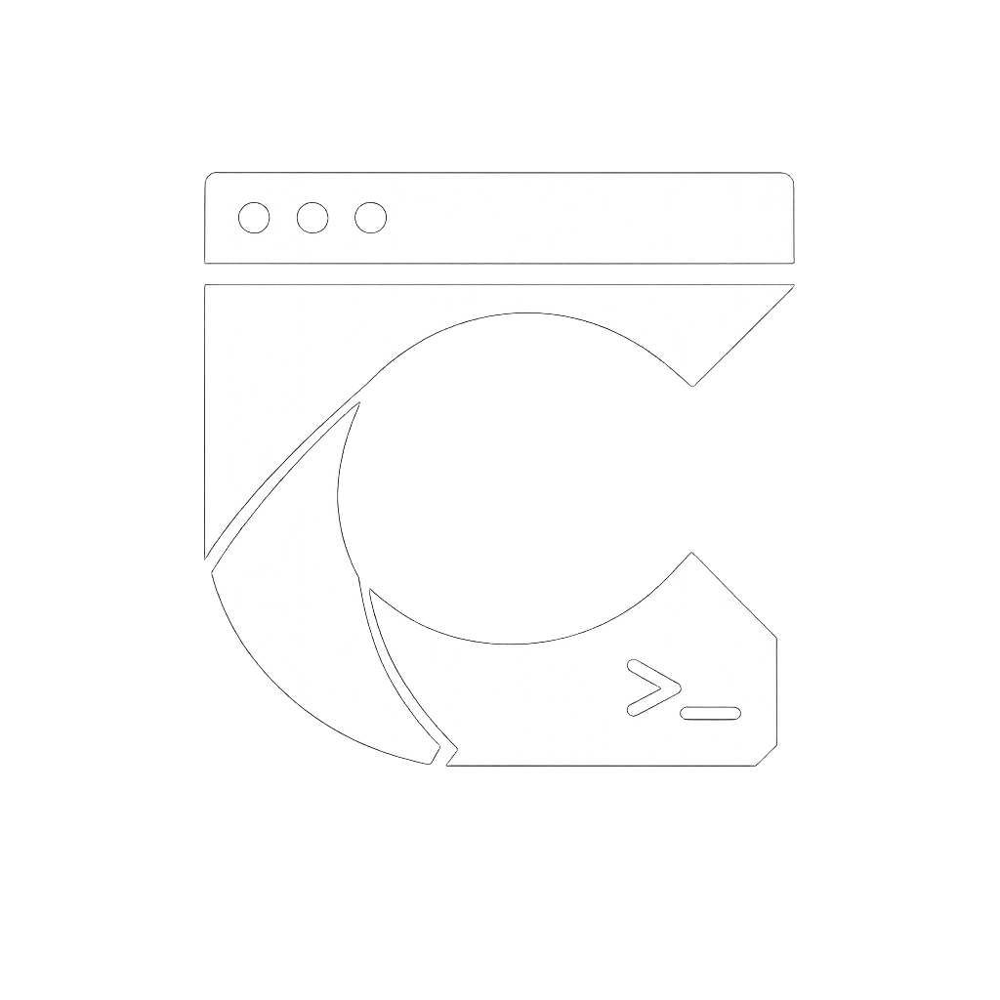

  

<h1 align="center">Cluaiz: High-Performance Inference Infrastructure</h1>

  <b>A Hardware Abstraction Layer (HAL) for Cross-Platform Native Inference.</b>

  
  
  

---

## 🛰️ 1. Technical Vision

Cluaiz is a high-performance **Hardware Abstraction Layer (HAL)** designed to eliminate vendor-specific silicon dependencies. It provides a standardized execution interface for cognitive models across NVIDIA, Apple Silicon, AMD, and ARM architectures.

### ⚡ The Zero-Environment Mandate (Cluaiz vs. Monoliths)
Unlike Ollama, vLLM, or other standard inference engines, Cluaiz is engineered for **Bare-Metal Efficiency**:
- **No Docker/VM Requirement**: Traditional engines often require Docker or a Linux environment (WSL/Virtual Machines) to run on Windows and macOS. This adds massive overhead to RAM and CPU.
- **Direct Silicon Handshake**: Cluaiz speaks directly to the hardware (DirectX, Metal, CUDA) without any intermediate Linux layers. 
- **Minimum Power Consumption**: By eliminating environment bloat, Cluaiz achieves the lowest possible CPU/GPU power draw, making it the only viable choice for high-performance mobile (Android) and desktop execution.

---

## 🧬 2. Core Engineering Pillars

### ⚡ A. Ternary Native Compute Engine (Engine C)
Optimized for 1-bit and 1.58-bit architectures, Engine C bypasses standard 16-bit upscaling overhead.
- **Arithmetic Logic**: Replaces standard **Floating Point Matrix Multiplication** with specialized **Addition and Subtraction** kernels, reducing compute load by up to 80%.
- **Silicon Throughput**: Achieves bare-metal execution speeds with a significantly reduced VRAM footprint.

### 🧵 B. State Injection Protocol (AtmaSteer)
To prevent "Context Drift" in long-duration sessions, Cluaiz implements a direct state manipulation protocol.
- **KV-Cache Bucketing**: Constraints and behavioral rules are injected directly into **16-token KV-cache segments** as physical memory states.
- **Atomic Adherence**: Ensures 100% adherence to system instructions without consuming prompt context.

### 🧠 C. Relational State Persistence (Neural Graph)
Cluaiz utilizes a tiered memory hierarchy to provide theoretically infinite context management.
- **Vector & Relational Storage**: High-throughput indexing using **LanceDB** and **SurrealDB** for session state persistence.
- **State Stitching**: The system identifies relevant historical state fragments and re-mounts them into the active execution window with zero re-computation overhead.

### 🛡️ D. Direct Hardware Linkage (DHL)
Built in **Rust**, Cluaiz ensures zero-latency communication with the host silicon.
- **FFI Orchestration**: Dynamically binds C++/CUDA shared libraries at runtime, bypassing high-level software wrappers (Python/Docker).
- **Instruction Set Mastery**: Optimized for AVX-512, Neon, and Metal Performance Shaders (MPS).

### ✨ E. Behavioral Alignment & Dynamic LoRA
The system implements a multi-path reasoning framework for complex problem solving.
- **Profiling**: Tracks behavioral patterns and alignment to refine neural responses in real-time.
- **Weight Hardening**: Verified knowledge and behavioral states are permanently integrated into the inference path via **Low-Rank Adaptation (LoRA)**.

---

## 🏗️ 3. Architectural Specification

Cluaiz is engineered as a decoupled, 3-tier ecosystem for maximum modularity.

### 🧩 System Modules
- **`cluaiz-cure/`**: The core execution hub. Manages low-level FFI and compute orchestration.
- **`brain/`**: The consolidated persistence layer. Manages the Relational State Memory.
- **`Apps/cli/`**: The high-performance terminal interface and command orchestrator.
- **`driver-manager/`**: The JIT provisioner for hardware probing and kernel management.

---

## 📦 4. Provisioning & Execution Lifecycle

1.  **Hardware Probing**: Deep scan identifies host architecture and silicon ID.
2.  **Artifact Mapping**: Maps hardware profile to a specific versioned kernel in the registry.
3.  **Integrity Validation**: Verifies SHA-256 binary hash before execution.
4.  **Process Binding**: Dynamically loads the kernel into process memory for native execution.

---

## 🛡️ 5. License: Cluaiz Systems License (CSL)

Cluaiz is governed by the **[CLUAIZ SYSTEMS LICENSE (CSL) v1.0](LICENSE)**.

- **Free for Individuals**: No cost for individuals and entities below $1M revenue.
- **Contributor Waiver**: Active core contributors get a full commercial waiver regardless of revenue.
- **Enterprise Mandate**: Entities above $1M revenue require a Commercial Agreement.
- **Architecture Lock**: Cloning our 3-tier design or AtmaSteer logic for competitors is prohibited.

---

## 🏛️ Institutional Standing

Cluaiz-OS is maintained and governed by **Cluaiz Technologies**, a registered Micro Enterprise under the **Ministry of MSME, Government of India** (Registration No: **UDYAM-UP-03-0131764**). 

### 🛰️ Sovereign Documents
- **[Architecture Deep-Dive](ARCHITECTURE.md)**: Technical breakdown of the 3-Tier design.
- **[Contribution Protocol](CONTRIBUTING.md)**: How to earn the Tier B Commercial Waiver.
- **[Security Policy](SECURITY.md)**: Reporting vulnerabilities privately.

---
© 2026 Cluaiz. All Rights Reserved. High-Performance Infrastructure.
