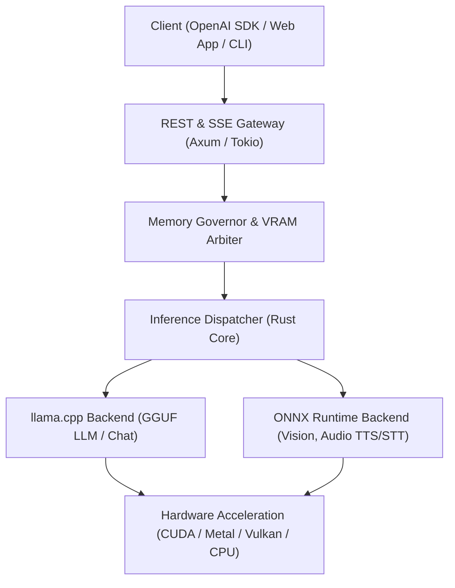

<p align="center">
  <picture>
    <source media="" srcset="assets/Banner.png">
    
  </picture>
</p>
<h3 align="center">
Single-Binary, Unified Local AI Runtime in Rust
</h3>
<p align="center">
Run GGUF LLMs, ONNX Vision, Text-to-Speech (TTS), and Speech-to-Text (STT) locally with zero Python, zero Docker dependencies, and an OpenAI-compatible REST API.
</p>

<p align="center">
  
  
  
  
  
</p>

<p align="center">
  <a href="https://cluaiz.com/docs"><b>Documentation</b></a> &nbsp;|&nbsp;
  <a href="https://cluaiz.com"><b>Website</b></a> &nbsp;|&nbsp;
  <a href="https://discord.gg/mab8kBURz"><b>Discord</b></a> &nbsp;|&nbsp;
  <a href="https://reddit.com/u/cluaiz"><b>Reddit</b></a> &nbsp;|&nbsp;
  <a href="https://linkedin.com/company/cluaiz"><b>LinkedIn</b></a>
</p>

---

## ⚡ What is Cluaiz?

**Cluaiz is a high-throughput, standalone local inference runtime built in Rust.** It unifies large language models, vision models, and neural audio engines into a single, self-contained binary.

Instead of running separate Python processes or Docker containers for LLMs, Whisper, and TTS, Cluaiz orchestrates all modalities natively in shared memory:

- **Dual-Engine Core**: Orchestrates GGUF models via embedded `llama.cpp` and multimodal pipelines (Vision, Whisper STT, Kokoro/Piper TTS) via embedded `ONNX Runtime`.
- **OpenAI-Compatible REST Gateway**: Drop-in compatibility for `/v1/chat/completions`, `/v1/models`, `/v1/embeddings`, `/v1/audio/speech`, and `/v1/audio/transcriptions`.
- **Hardware-Aware Memory Governor**: Evaluates available physical VRAM and RAM in real time, enforcing dynamic context limits and safety buffers to prevent Out-of-Memory (OOM) crashes on consumer hardware.
- **Agentic Tool Pivot**: Supports mid-generation tool calling and KV-cache continuation without prompt recalculation.
- **Developer Hub**: Integrated local web dashboard for monitoring memory consumption, configuring model slots, and testing endpoints live.

---

## 🚀 Quick Start

### 1. Installation

**Windows (PowerShell)**
```powershell
powershell -c "irm https://cluaiz.com/install.ps1 | iex"
```

**Linux & macOS (Shell)**
```bash
curl -fsSL https://cluaiz.com/install.sh | bash
```

*Or download the pre-compiled standalone binary directly from [GitHub Releases](https://github.com/cluaiz/cluaiz/releases).*

---

### 2. Start the API Daemon

Launch the background daemon on `http://127.0.0.1:8000`:
```bash
cluaiz serve
```

### 3. Use with any OpenAI SDK / Client

Cluaiz works as a drop-in replacement for the OpenAI API:

```python
from openai import OpenAI

client = OpenAI(
    base_url="http://127.0.0.1:8000/v1",
    api_key="cluaiz"  # Any string works locally
)

response = client.chat.completions.create(
    model="auto",  # Automatically uses the model active in the chat slot
    messages=[{"role": "user", "content": "Hello Cluaiz! Explain quantum computing in one sentence."}],
    temperature=0.7,
    max_tokens=100
)

print(response.choices[0].message.content)
```

---

## 💻 CLI Commands Reference

| Command | Description |
|:---|:---|
| `cluaiz serve` | Start the OpenAI-compatible HTTP/SSE API daemon on `http://localhost:8000`. |
| `cluaiz` | Launch the interactive Terminal Control Dashboard (TUI). |
| `cluaiz pull <hf-repo-id>` | Download and register a GGUF or ONNX model directly from Hugging Face Hub. |
| `cluaiz models list` | List all locally cached and installed models in the registry. |
| `cluaiz inspect <model_file>` | Directly probe and inspect GGUF binary header metadata without loading weights. |
| `cluaiz benchmark` | Run hardware-level TPS, memory bandwidth, and SIMD execution tests. |

---

## 🏗️ Architecture Overview



### Key Architectural Modules

1. **`cmd/`**: CLI router, argument parser, and terminal user interface (Ratatui).
2. **`inference-engine/api/`**: Axum HTTP API gateway implementing OpenAI REST specifications.
3. **`inference-engine/engines/`**: Model registry, Hugging Face downloader, and GGUF/ONNX binary probers.
4. **`interface-engines/llama/`**: Direct C FFI bindings to `llama.cpp` with custom sampler chaining (`top_k`, `top_p`, `min_p`, temperature) and BitNet greedy decoding.
5. **`interface-engines/onnx/`**: Direct C FFI bindings to `ONNX Runtime` for Kokoro/Piper TTS, Whisper STT, and Vision encoders.

---

## 📊 Empirical Benchmarks

*Measured locally on an **NVIDIA GeForce RTX 3050 Laptop GPU (4GB VRAM, CUDA 12)** running Cluaiz:*

| Model | Quantization | Tokens / Sec (TPS) | Time to First Token (TTFT) | VRAM Usage | Context Window |
|:---|:---:|:---:|:---:|:---:|:---:|
| **Qwen 2.5 1.5B Instruct** | Q4_K_M | **48.2 TPS** | 0.04s | ~1.4 GB | 8192 |
| **Llama 3.2 3B Instruct** | Q4_K_M | **31.6 TPS** | 0.06s | ~2.2 GB | 8192 |
| **Gemma 2 2B Instruct** | Q4_K_M | **34.1 TPS** | 0.05s | ~1.8 GB | 4096 |
| **Qwen 2.5 7B Instruct** | Q4_K_M | **16.8 TPS** | 0.12s | ~3.8 GB (Offloaded) | 4096 |
| **Kokoro v1 (TTS)** | FP16 ONNX | **~15x Realtime** | 0.02s | ~350 MB | — |
| **Whisper Small (STT)** | INT8 ONNX | **~12x Realtime** | 0.03s | ~400 MB | — |

*To run automated benchmarks on your own machine, execute `cluaiz benchmark` or see the test suite in `test/benchmark/`.*

---

## 🛡️ Modality & Format Support Matrix

| Modality / Task | Supported Formats | Engine Backend | Notes |
|:---|:---:|:---:|:---|
| **Text Chat / Instruct** | GGUF | `llama.cpp` | Full sampler support (`temperature`, `top_p`, `top_k`, `min_p`, repetition penalties). |
| **1-Bit / Ternary LLMs** | GGUF (BitNet / Bonsai) | `llama.cpp` | Native greedy argmax decoding. |
| **Text Embeddings** | GGUF, ONNX | `llama.cpp`, `ONNX Runtime` | Returns dense embedding vectors (`/v1/embeddings`). |
| **Text-to-Speech (TTS)** | ONNX | `ONNX Runtime` | Multi-family support (Kokoro, Piper/VITS, Supertonic). |
| **Speech-to-Text (STT)** | ONNX | `ONNX Runtime` | Whisper family transcription (`/v1/audio/transcriptions`). |
| **Vision (VQA / OCR)** | ONNX | `ONNX Runtime` | Multimodal visual feature extraction. |

---

## 🧪 Testing & Validation

Cluaiz includes an automated smoke test suite for validating API endpoints, response constraints, and lifecycle management:

```bash
# Run automated API smoke tests (automatically starts daemon, verifies, and shuts down)
powershell -ExecutionPolicy Bypass -File ./test/smoke.ps1 -StartServer

# Or on Linux / macOS
./test/smoke.sh --start
```

---

## 📄 License

Cluaiz is open-source software licensed under the **[Apache License 2.0](LICENSE)**.
