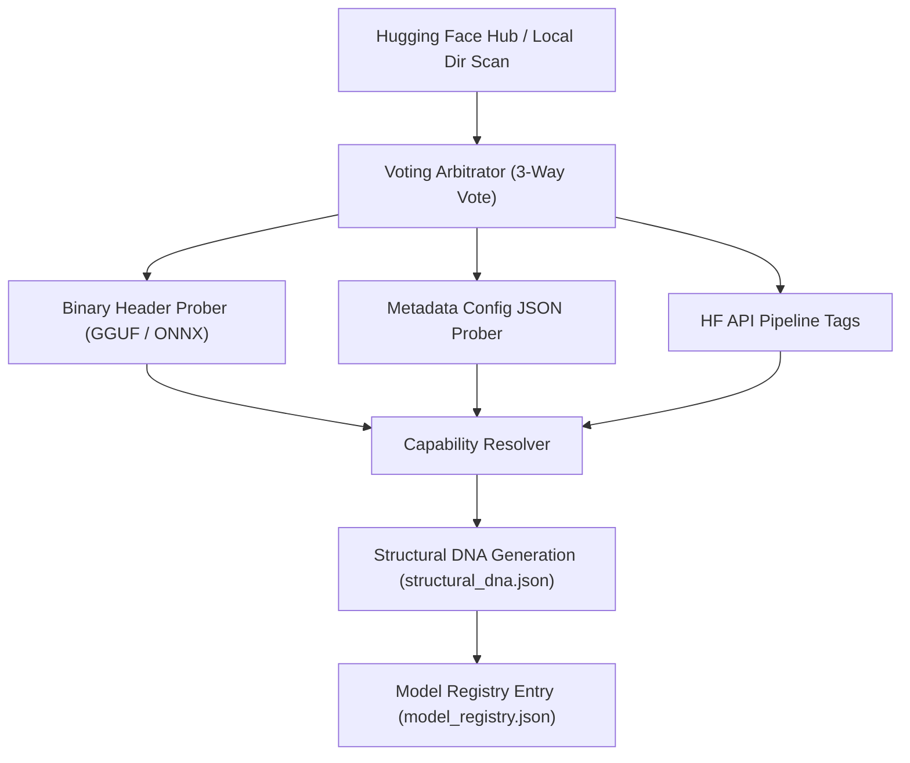

# Cluaiz Inference Engine: Model Format & Architecture Release Matrix

This document defines the official support matrix, package contracts, and the dynamic capability resolution architecture for the Cluaiz Inference Engine.



---

## 📊 Core Task Support Matrix

| Category / Modality | GGUF Support | ONNX Support | Target Engines & Frameworks |
| :--- | :---: | :---: | :--- |
| **Chat (Instruct / Base)** | ✅ Yes | ❌ No (Roadmap) | Llama.cpp (GGUF) |
| **Embedding (Text Vectors)** | ✅ Yes | ✅ Yes | Llama.cpp (GGUF), ONNX Runtime (ONNX) |
| **Vision (Multimodal Chat)** | ❌ No | ✅ Yes | ONNX Runtime |
| **Audio STT (Speech-to-Text)**| ❌ No | ✅ Yes | ONNX Runtime (Whisper-ONNX) |
| **Audio TTS (Text-to-Speech)**| ❌ No | ✅ Yes | ONNX Runtime (Multi-Family Engines) |

> [!TIP]
> **Universal Precision & Quantization Support**:
> Cluaiz dynamically supports and executes all standard weight precisions natively. This includes **GGUF** (Q4_K_M, Q8_0, Q5, etc.) and **ONNX** (FP32, FP16, INT8, INT4, etc.).

> [!NOTE]
> **Supported Vision Task Types**:
> - `multimodal-dialogue` (Visual Question Answering & Vision Chat)
> - `image-to-text` (Image Captioning)
> - `visual-question-answering` (VQA)
> - `text-to-image` (Image Generation / Stable Diffusion)
> - `text-to-video` (Video Generation)
> - `optical-character-recognition` (Visual OCR / Document Parsing from images & scanned documents)
> - `vision-feature-extraction` (CLIP / Image Embedding Vector extraction)
>
> **Document Ingestion & OCR Processing Modes**:
> - **Native Text PDFs**: Processed efficiently on CPU using the `pdf-extract` engine (fast, zero-VRAM footprint).
> - **Scanned Documents & Images**: Routed dynamically to visual ONNX models (e.g. Qwen-VL, Phi-3-Vision) for character recognition (OCR) and layout parsing.

---

## 🎙️ Supported Audio & TTS Model Families

The Cluaiz Engine implements strict package validation contracts across 8 core TTS architectural families and 1 core STT family:

### 1. Text-to-Speech (TTS) Families

| Family Name | Internal Identifier | Status | Required Assets / Package Contract | Primary Graph Details |
| :--- | :--- | :--- | :--- | :--- |
| **Kokoro** | `kokoro-v1` | `✅` | Primary model (`*kokoro*.onnx`), `config.json`, `tokenizer.json`/`vocab.json`, and non-empty `voices/` directory containing `.bin`/`.json` voice styles. | Acoustic text-to-phoneme + style latent decoder |
| **Supertonic** | `supertonic-v3` | `✅` | 4-Stage Pipeline: `text_encoder.onnx`, `duration_predictor.onnx`, `vector_estimator.onnx`, and `vocoder.onnx` / `hift.onnx`. | Multistage diffusion synthesis pipeline |
| **VITS / Piper** | `piper-vits` | `✅` | Primary model (`model.onnx`), `config.json`, and phoneme map (`tokens.txt`). | End-to-end VITS / Piper architectures |
| **Matcha-TTS** | `matcha-v1` | `⏳` | Acoustic Flow Matching graph (`matcha.onnx`/`fm_decoder.onnx`) + HiFi-GAN or WaveNext neural vocoder sub-graph. | Flow-matching ODE synthesis |
| **CosyVoice** | `cosyvoice` | `⏳` | `speech_llm.onnx` / `flow.onnx` / `hift.onnx` / `campplus.onnx` (or combined graph). | Autoregressive + flow-matching pipeline |
| **Audio8** | `audio8-codec` | `⏳` | 4-bit `slow_ar` generator + FP16 `codec_decoder` neural vocoder. | Autoregressive token generation |
| **Chatterbox** | `chatterbox` | `⏳` | Semantic generator (`chatterbox_generator.onnx`) + audio codec decoder. | Codec-based language modeling |
| **OmniVoice** | `omnivoice` | `⏳` | Primary model (`model.onnx`) + large companion weight file (`model.onnx.data`) + `genai_config.json`. | External weight data graph |

### 2. Speech-to-Text (STT) Families

| Family Name | Internal Identifier | Format | Primary Graph Details |
| :--- | :--- | :---: | :--- |
| **Whisper** | `whisper` | ONNX | Encoder-Decoder architecture for speech transcription and translation. |

---

## 🧬 Dynamic Capability Discovery & The DNA Handshake

To support thousands of arbitrary Hugging Face repositories framework-free, Cluaiz implements a **3-Way Voting Arbitrator** at boot-scan:

1. **Binary Header Probing**: Probes the first few megabytes of the weight binary (`.gguf` or `.onnx`) to extract truth directly from compiler metadata (e.g., context window size, tensor types, quantization tags).
2. **Metadata Config JSON Ingestion**: Fallbacks to reading `config.json` or model manifests to resolve model architectures.
3. **HF API Pipeline Tags**: Maps HuggingFace repository pipeline tags to categories.
 

---

## 🗂️ Local Model Registry (`model_registry.json`)

- **Primary Path**: `~/.cluaiz/engine/config/model_registry.json` (or fallback to `.cluaiz/engine/config/model_registry.json` in the working directory).
- **Functionality**: Serves as the localized state management vault. It maps every installed model with its absolute path, category, format type (GGUF/ONNX), and validated tasks. 

---

## 💻 Command Line Interface (CLI) Commands

### 1. Download & Install Model
To scan the Hugging Face Hub, register, and download a model:
```bash
cluaiz pull <huggingface-org>/<repo-name>
# Example:
cluaiz pull onnx-community/whisper-large-v3-turbo
```

### 2. Run / Pull with All Assets (Bypass Filters)
To download **all files and supplementary assets** in a repository (e.g. including espeak, style files, voice styles) bypassing format limits:
```bash
cluaiz run <model-id> --all
# or using the shorthand:
cluaiz run <model-id> --a
```

---

## 🔌 API Inference Endpoints

The Cluaiz HTTP server exposes the following endpoints (default port: `8000`):

- **`POST /v1/chat/completions`**: OpenAI-compatible text generation.
- **`POST /v1/audio/execute`**: Multimodal audio execution. Processes both Text-to-Speech (TTS) and Speech-to-Text (STT/Transcription).
- **`POST /v1/embeddings`**: Text embedding vector generation.
- **`POST /v1/ingest/file`**: Native document parser (CPU-based text extraction for text PDFs, images, etc.).
- **`POST /v1/execute/{component}/{function}`**: Invokes custom installed WASM components.

