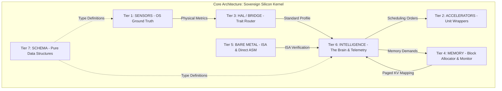

# 🏛️ Sovereign Silicon Kernel: Hardware Abstraction & Telemetry Engine
## Software Design & Architecture (v3.0 - Modular Lockdown)

Welcome to the **Sovereign Silicon Kernel**. This engine is the innermost layer of the Cluaiz AI CURE, designed for 100% hardware-native execution and zero-latency neural orchestration.

---

## 📑 The 7-Tier Domain Architecture

To achieve absolute agnosticism and "AtmaSteer" readiness, the kernel is strictly divided into seven decoupled domains:



---

## 🏛️ Domain Specifications

### 1. Tier 1: SENSORS (The Ground Truth)
- **Role:** Direct OS interrogation (`sysctl`, `procfs`, `WMI`).
- **Policy:** This is the **ONLY** layer allowed to use `cfg!(target_os)`. Any platform-specific logic leaking outside this tier is a violation of the ARCHER Protocol.
- **Components:** `darwin_sensor.rs`, `linux_sensor.rs`, `windows_sensor.rs`, `android_sensor.rs`.

### 2. Tier 2: ACCELERATORS (Hardware Units)
- **Role:** Pure API wrappers for compute blocks.
- **Components:** `cpu.rs`, `gpu.rs`, `npu_tpu.rs` (Fused logic).
- **Agnosticism:** These modules call the HAL and never assume a specific backend exists.

### 3. Tier 3: HAL / BRIDGE (The Contract)
- **Role:** Defines the `SiliconProvider` trait and selects the active sensor via the `Factory` pattern.
- **Components:** `provider.rs`, `platform_identity.rs`, `factory.rs`.

### 4. Tier 4: MEMORY (Subsystem Orchestration)
- **Role:** Manages the `SiliconBlockAllocator` for KV-Cache blocks.
- **Logic:** Prepares the system for **AtmaSteer** (Direct Tensor Injection) by carving out paged memory segments.
- **Components:** `allocator.rs`, `monitor.rs`.

### 5. Tier 5: BARE METAL (ISA Depth)
- **Role:** Inline assembly register queries to bypass OS abstractions.
- **Components:** `isa_probe.rs`.

### 6. Tier 6: INTELLIGENCE (Executive Layer)
- **Role:** Real-time decision making and telemetry.
- **Governance:** `Governor` locks physical boundaries (GHz, Threads) at boot.
- **Scheduling:** `Scheduler` routes compute paths based on structural neural constraints.
- **Telemetry:** `GhostObserver` (Lock-Free) monitors at 0.0ms latency.
- **Components:** `governor.rs`, `scheduler.rs`, `telemetry.rs`, `speed_checker.rs`.

### 7. Tier 7: SCHEMA (Mathematical Identity)
- **Role:** Zero-dependency data structures.
- **Components:** `profiles.rs`, `metrics.rs`.

---

## 🔄 Logic Trace: The Execution Pulse

```text
1. [BOOT]       Governor identifies and locks hardware identity in system_control.json.
2. [SENSING]    Sensors probe physical reality (Cores, GHz, VRAM).
3. [ROUTING]    Factory routes standard metrics into the HAL Bridge.
4. [SCHEDULING] Intelligence decides Backend (Cuda/Metal/SIMD) based on model architecture.
5. [MONITORING] GhostObserver begins 0.0ms atomic frequency polling in background.
6. [ALLOCATION] Memory subsystem maps paged blocks for upcoming KV-Injection.
```

---

## 🛡️ Sovereign Protocol Rules

1. **NO UNWRAP:** Zero panics are tolerated in sensor logic. Fallbacks are mandatory.
2. **NO MUTEX IN TELEMETRY:** Telemetry must be 100% Lock-Free (Atomic) to ensure zero context switching during inference.
3. **STATIC IDENTITY:** Theoretical benchmarks are banned. Hardware is evaluated via physical extraction.

---
*Maintained by the Archer Lead CTO Focal Point*
