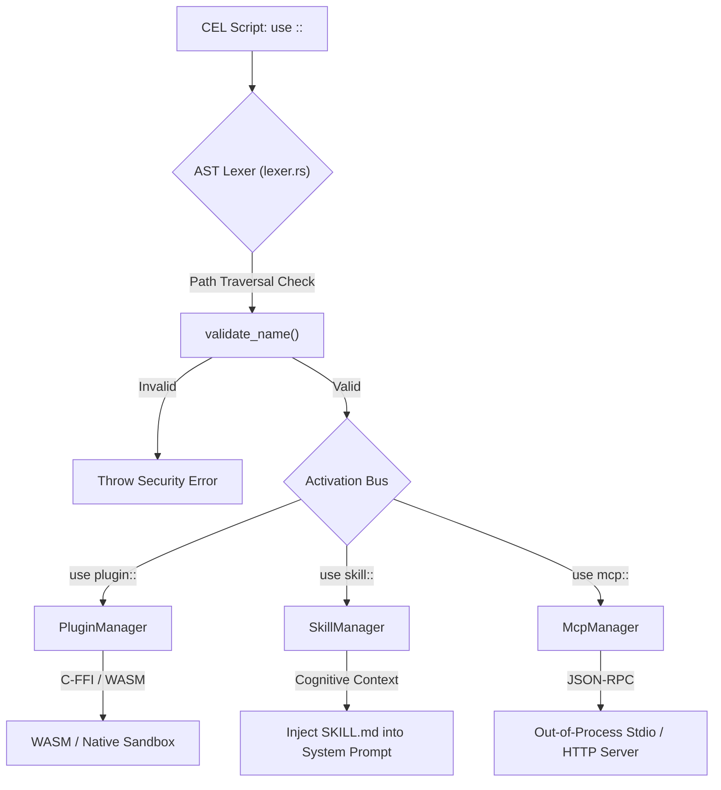

# Dynamic Linking (`use`)

cluaiz is built on a highly modular architecture. The core Engine (`inference-engine`) only handles execution, memory routing, and VRAM mapping. Actual capabilities (Web Scraping, Database I/O, API calling) are completely decoupled and loaded dynamically.

Unlike standard languages where `import` gives modules full access to your system, the cluaiz Engine operates a strict **Tripartite Registry** of three core pillars: **Plugins**, **Skills**, and **MCP**.

## The Architecture: How the Engine Routes Code

When the Engine cold-boots, it parses the `registry.yaml` and splits external modules into distinct components managed by dedicated injectors. 

Here is the exact hardware flow of how the `ActivationBus` handles the `use` directive:



---

## 1. The Core Differences (Skill vs Plugin vs MCP)

Before jumping into syntax, you must understand how the Engine classifies these modules:

| Module Type | The Brain (`SKILL.md`) | The Muscle (Binary) | Format / Language | Sandbox Location | Isolation & Security | Engine Role & Example Use Case |
|---|---|---|---|---|---|---|
| **Skill** | ✅ Yes | ❌ No | Markdown / Text | None (Pure Context) | N/A (Safe System Instructions) | Injects domain intelligence and execution affordance into the LLM context. <br>*(Example: Git Commit Best Practices, SQL Generator)* |
| **Plugin** | 🟡 Optional | ✅ Yes | `.wasm`, `.dll`, `.so` | In-Process (Engine RAM) | Strict Linear Memory Limits & Fuel Limits (WASM) | Ultra-fast native execution. Direct memory pointers via zero-copy C-ABI buffers. <br>*(Example: Fast Math Parser, Web Scraper, Native Vector Search)* |
| **MCP** | 🟡 Optional | ❌ No (External) | JSON-RPC (HTTP/Stdio) | Out-of-Process | OS-Level (Separate Process) | Connects to standard Model Context Protocol servers. Hot-pluggable without touching engine memory. <br>*(Example: GitHub MCP, Postgres MCP)* |

---

## 2. The Plugin (`use plugin::`)

**The Functional Muscle.** 

Plugins are purely functional blocks of code compiled into WebAssembly (`.wasm`) or Native Shared Libraries (`.dll`, `.so`). They execute with bare-metal speed.

* **Internal Manager:** `PluginManager`
* **Under the Hood:** 
  * If it's a `.wasm` file, the Engine loads it into a `DashMap` based global `WASM_CACHE`. It executes inside `wasmtime`'s linear memory with fuel boxing.
  * If it's a `.dll` / `.so`, the Engine loads it using Rust's `libloading` crate, strictly sanitizing the path via `std::fs::canonicalize`.
* **CEL Syntax:**
```cel
// 1. Loads the binary into the Engine's memory sandbox
let $web_tools = use plugin::cluaiz-search

// 2. Invokes a specific entrypoint via zero-copy C-ABI pointer
let $results = $web_tools -> invoke(search, query: "Cluaiz Engine architecture")
```

---

## 3. The Skill (`use skill::`)

**The Cognitive Brain.** 

Skills are pure markdown instructional blueprints (`SKILL.md`). They teach the AI model domain workflows, prompt strategies, and deterministic response formats.

* **Internal Manager:** `SkillManager`
* **Under the Hood:** When `use skill` is called or triggered by semantic routing, the Engine reads `SKILL.md` and dynamically injects its semantic rules into the LLM's active context window without restarting the inference server.
* **CEL Syntax:**
```cel
// 1. Injects specialized domain knowledge into LLM prompt
let $coder = use skill::rust-optimizer

// 2. AI generates code following the strict rules defined in the skill
let $code = $coder -> generate("Refactor this Tokio loop for zero allocations")
```

---

## 4. Model Context Protocol (`use mcp::`)

**The Out-of-Process Connector.** 

cluaiz natively supports the [Model Context Protocol (MCP)](https://modelcontextprotocol.io/).

* **Internal Manager:** `McpManager`
* **Under the Hood:** The Engine stores connection metadata in its registry. When invoked, it **does not load any binary into engine memory**. Instead, it spawns an isolated child process or opens an HTTP/SSE stream and communicates via standard JSON-RPC. If the MCP server crashes, the Engine remains rock-solid.
* **CEL Syntax:**
```cel
// Establishes a JSON-RPC stdio connection to the external MCP server
let $gdrive = use mcp::google-drive

// Sends an RPC request to the server, waiting for a JSON response
let $files = $gdrive -> call_tool(list_files, folder_id: "root")
```

---

## 🚨 Security & Memory Boxing

The Engine never blindly trusts a `use` directive:

1. **Fuel Limits (WASM Sandbox):** Before executing a `.wasm` plugin, the Engine wraps execution in a `wasmtime::Store` with strict fuel limits (`store.set_fuel(10_000)`). If a malicious or runaway routine enters an infinite loop, it is killed instantly.
2. **Lexer Security (Path Traversal Protection):** When the AST Lexer parses your `use` directive, it runs a hardcore `validate_name()` check. By strictly disallowing `/`, `\`, and `..`, directory traversal attacks are mathematically blocked at the lexer stage before touching disk.
