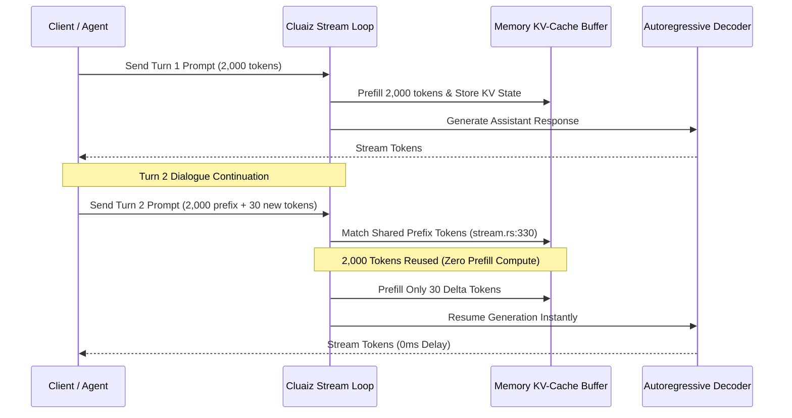

# Prefix Caching Architecture & Delta Resumption

## 1. Overview & Core Mechanism
Traditional Large Language Model (LLM) inference runtimes process multi-turn conversations and tool executions by re-evaluating the entire conversation history from scratch (full prefill). In long-running agentic loops, repeated prompt recomputations cause significant Time to First Token (TTFT) latency spikes and unnecessary compute waste.

**Cluaiz Prefix Caching** solves this bottleneck at the native C-ABI stream level. When continuing dialogues or receiving tool execution results, the engine matches the incoming token prefix against the active Key-Value (KV) cache memory. Only new delta tokens are decoded, while the shared conversation prefix stays active in memory.

---

## 2. Multi-Turn Execution & Delta Decoding

The Prefix Caching pipeline operates deterministically inside the native stream loop (`interface-engines/llama/src/native/stream.rs`):



1. **Prefix Match:** During sequence evaluation, the engine compares prompt tokens against cached sequences:
   ```rust
   while match_len < min_len && last_prefilled[i] == tokens[i] {
       match_len += 1;
   }
   ```
2. **Delta Evaluation:** If the initial tokens match, the engine skips re-evaluating the matched slice and feeds only the remaining delta tokens to the compute backend.
3. **Mid-Stream Tool Resumption (`[PIVOT_CONTINUE]`):** When an agent executes a CEL hook or external tool, the active KV-cache is preserved. Once the tool output arrives, the engine seamlessly appends the tool response and resumes inference without recomputing the dialogue history.

---

## 3. Hardware-Agnostic Execution

Prefix Caching operates across all supported hardware backends:
* **CPU Execution:** Eliminates matrix multiplications over repeated system instructions on CPU threads.
* **GPU Execution (CUDA/Metal/Vulkan):** Preserves VRAM tensor allocations and reduces memory bandwidth pressure across multi-turn sessions.

---

## 4. Security & Memory Boundaries

Prefix Caching memory allocations are strictly bounded:
* **Session Isolation:** Each active sequence maintains deterministic boundaries to prevent cross-session memory bleed.
* **Payload Safety Guards:** Tool outputs passed to the engine are validated through size limiters (`300MB` safe threshold) to prevent buffer overflows.
