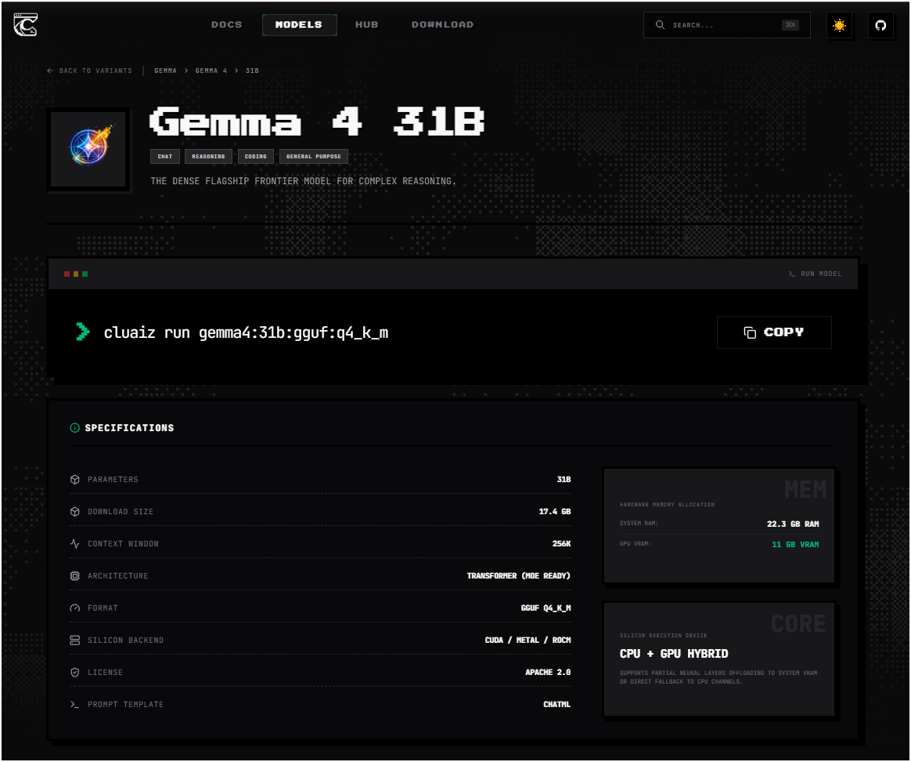

# 📥 HuggingFace Model Downloading & Management

To run models locally, the Cluaiz Engine includes a high-performance, edge-optimized downloader designed to pull weight tensors, tokenizers, and configurations directly from the HuggingFace Hub. 

This guide details how model retrieval works, how files are organized on disk, and how to download models via both the terminal and the web dashboard.

> [!IMPORTANT]
> **Supported Formats Notice**
> The Cluaiz Engine currently **only supports GGUF and ONNX** model formats for local inference. When querying repositories, the engine filters out raw PyTorch weights or uncompiled SafeTensors, presenting only GGUF and ONNX variants for download. Ensure the model you wish to pull is packaged in one of these formats.

---

## 🚀 How Model Downloading Works

When you run `cluaiz run <repo-id>` or `cluaiz pull <repo-id>` (or trigger `POST /models/download` via the API / Web UI), the engine executes the following steps:

1. **HuggingFace API Scan**: Recursively scans the target repository's file tree to identify all `.gguf` or `.onnx` files.
2. **Dynamic Variant Grouping**: Automatically groups files into logical bundles based on their formats and quantization tags (e.g., `Q4_K_M`, `INT8`, `bf16`).
3. **Dynamic Architecture Probing**: If the model type is not returned by the standard HF API, the engine fetches the repo's root `config.json` directly from the HF CDN to extract the real model architecture (e.g., `Whisper`, `Gemma`, `Qwen`) before downloading.
4. **Interactive Selection**: Displays a clean, tree-like overview of the variant files and prompts the user for confirmation.

---

## 💻 Terminal / CLI Downloading Interface

When pulling models via the CLI (`cluaiz run <repo-id>`), you can pass any HuggingFace repository ID directly. For example, to download and run the optimized Whisper Large V3 Turbo model:

```bash
cluaiz run onnx-community/whisper-large-v3-turbo
```

Upon execution, the engine displays a structured file bundle tree showing the model binaries, external data files, and variant-specific configurations before asking for download confirmation:


---

## 🌐 Web Dashboard Downloading Interface

In addition to the terminal, you can manage and download model variants directly from the **Developer Hub Web Dashboard**. 

If a model is missing from your local library, you can search for any arbitrary HuggingFace repository ID. The dashboard queries the hub, retrieves the available GGUF/ONNX variants, and displays their sizes, architectures, and quantizations for simple one-click downloading:



*Simply input any repository ID (e.g., `unsloth/GLM-5.2-GGUF` or `onnx-community/whisper-large-v3-turbo`) to pull it directly into your local vault.*

---

## 📂 Secure Model Vault Structure (`~/.cluaiz/models/`)

The Secure Model Vault isolates models into distinct sub-folders on disk based on their detected capabilities. This ensures that the dispatch broker knows exactly which models are loaded for specific task modalities (Text, Audio, Vision, or Vector Embeddings).

### Directory Mapping Rules:
- **`models/chat/`**: 
  - **Type of Models:** Autoregressive Text Generation and Instruction-tuned Chat LLMs (e.g., Llama-3, Qwen-2.5, GLM-5).
  - **How it's mapped:** Matches HF pipeline tag `text-generation` or models with chat templates in their binary header.
- **`models/embedding/`**: 
  - **Type of Models:** Text vector embedding and feature extraction encoders (e.g., BGE, Nomic, GTE).
  - **How it's mapped:** Matches pipeline tags `feature-extraction` or `sentence-similarity`, or models showing pooling layers.
- **`models/vision/`**: 
  - **Type of Models:** OCR, VQA, image classification, diffusion, and vision-first models (e.g., LLaVA, Florence, Stable Diffusion).
  - **How it's mapped:** Matches pipeline tags `text-to-image`, `image-to-text`, or models containing vision encoder projection tensors.
- **`models/audio/`**: 
  - **Type of Models:** Automatic Speech Recognition (ASR), Text-to-Speech (TTS), and audio analysis (e.g., Whisper, Kokoro, Bark).
  - **How it's mapped:** Matches pipeline tags `automatic-speech-recognition` or `text-to-speech`, or models containing audio spectrogram projection layers.

---

## ⚙️ Key System Optimizations

### 1. Prefix-Compatible Scoped Metadata Harvesting
To prevent duplicate files and configuration conflicts:
- When a variant is selected (e.g., `Q4_K_M/cuda/decoder/model.onnx`), the downloader evaluates the directory path.
- It only harvests configurations matching that prefix (like `Q4_K_M/cuda/tokenizer.json` and root-level `config.json`).
- Sibling folder files (like `Q4_K_M/default/tokenizer.json`) are skipped, keeping your local installation minimal and conflict-free.

### 2. Local Vault Folder Flattening & Naming
HuggingFace repositories often have deeply nested folder structures. The Cluaiz Engine automatically:
- Strips remote directory prefixes (`rsplit('/')`) during download, saving files flatly inside the model folder.
- Names the folder dynamically using the format: `{category}/{safe_id}-{quant_tag}/` (e.g., `models/chat/GLM-5.2-GGUF-UD-IQ1_S/`).
- This clean, flat structure guarantees that the inference engine can resolve tokenizers and model binaries instantly without navigating nested folder paths.

### 3. Resumable Byte-Range Downloads
If a download fails mid-stream due to network drops:
- The engine uses HTTP Range headers (`Range: bytes=X-`) to verify already written file chunks.
- It skips verified blocks and resumes downloading the remaining payload, avoiding redundant bandwidth usage.
