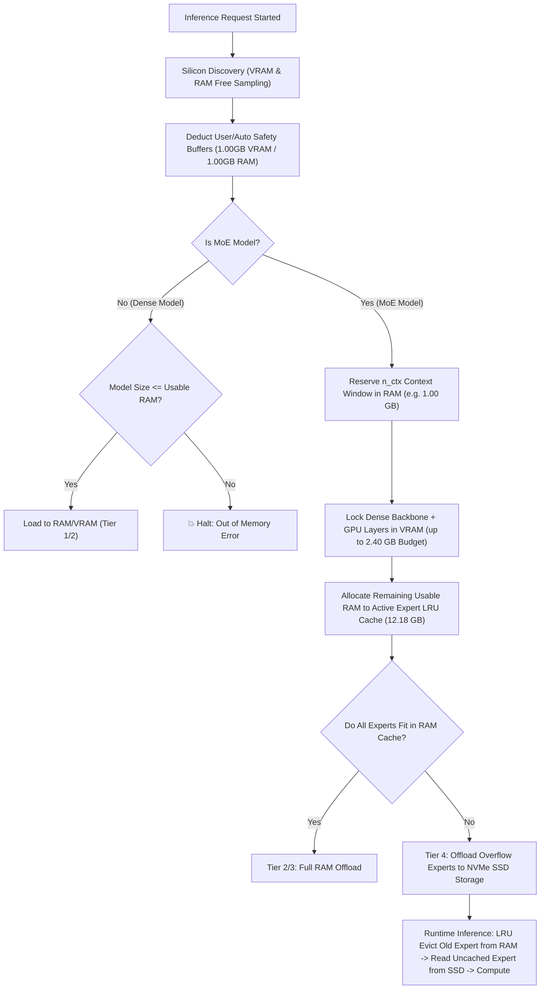

# Component: Expert Offloading Subsystem

The **Expert Offloading Subsystem** is the core memory governor for Mixture-of-Experts (MoE) model execution in Cluaiz. It provides cross-platform, storage-agnostic virtual memory management to enable local execution of massive models on consumer hardware by exchanging raw speed/throughput for memory capacity limits.

---

## Technical Specification

- **Purpose:** Prevents memory exhaustion and pagefile thrashing during MoE inference by separating model weights into a static VRAM-locked tier, a reserved RAM context window, an active RAM expert LRU cache, and an NVMe SSD dynamic streaming tier:
  1. **VRAM Tier (Pinned/Locked):** The dense backbone (attention blocks, shared experts, input/output embeddings) and a designated number of starting transformer layers (`n_gpu_layers`) are loaded into GPU VRAM at initialization and remain locked/pinned.
  2. **RAM Tier (Context & Active Cache):** Reserves a dedicated memory window for context tokens (`n_ctx` e.g., 1.00 GB) to guarantee zero-freeze session execution. The remaining usable RAM is allocated as an LRU Expert Cache.
  3. **SSD Tier (Dynamic Swapping):** All overflow MoE experts exceeding the active RAM cache budget reside on NVMe SSD storage. Individual expert weights are paged in dynamically on demand and LRU-evicted to maintain strict OS safety buffers.
- **Platform Support:** Cross-platform (Supports Windows via Win32 Virtual Memory APIs, Linux via POSIX `madvise`, macOS via Darwin virtual memory subroutines, and standard Unix-like platforms).
- **Storage Compatibility:** Hardware-agnostic (Designed to run on any virtual memory-mapped block storage device, including NVMe SSDs, SATA SSDs, or external storage volumes).
- **Reusability Level:** Shared Core Subsystem (Internal Engine Component).

---

## Unified Memory Negotiation & Placement Blueprint

When a model inference session initializes, the negotiator executes the following deterministic resource evaluation sequence:

### 1. Silicon Memory & Safety Buffer Formula
- **Usable VRAM Calculation:**
  $$\text{Usable VRAM} = \text{Free VRAM} - \text{Custom/Auto VRAM Buffer}$$
  *Example:* $3.40\text{ GB (Free VRAM)} - 1.00\text{ GB (Safety Buffer)} = 2.40\text{ GB Usable VRAM}$

- **Usable System RAM Calculation:**
  $$\text{Usable RAM} = \text{Free RAM} - \text{Custom/Auto RAM Buffer}$$
  *Example:* $14.18\text{ GB (Free RAM)} - 1.00\text{ GB (Safety Buffer)} = 13.18\text{ GB Usable RAM}$

- **RAM Context Window (`n_ctx`) Reservation:**
  $$\text{RAM Expert Cache Budget} = \text{Usable RAM} - \text{Context Window RAM Footprint}$$
  *Example:* $13.18\text{ GB Usable RAM} - 1.00\text{ GB (Context } n\_ctx\text{)} = 12.18\text{ GB Expert Cache}$

---

## Architectural & Execution Flow



---

## Standard System Log Format (Developer Verification Contract)

When the subsystem completes resource negotiation, it outputs a clean, deterministic log contract for developers:

```text
⚖️ [Negotiator] Silicon Hardware Detected: VRAM Total = 4.00 GB (Free = 3.40 GB) | System RAM Total = 24.00 GB (Free = 14.18 GB)
⚖️ [Negotiator] User Settings: custom_vram_buffer = 1.00 GB | custom_ram_buffer = 1.00 GB | extreme_moe_streaming = On | n_ctx = Auto 
⚖️ [Negotiator] Effective Usable Memory: Usable VRAM = 2.40 GB (Free VRAM 3.40GB - Safety 1.00GB) | Usable RAM = 13.18 GB (Free RAM 14.18GB - Safety 1.00GB)
🔍 [MoeDetector] Model Architecture: MoE Detected (128 Experts, 30 Layers, Size: 14.62 GB, Dense Backbone: 1.26 GB)
🧠 [Negotiator] Resource Placement & Tier Breakdown:
   ├── 🟢 VRAM Allocation (Budget: 2.40 GB):
   │    ├── Locked Dense Backbone: 1.26 GB
   │    ├── Locked GPU Layers: 4 Attention Layers (0.84 GB)
   │    └── VRAM Used / Total Free: 2.10 GB / 3.40 GB (Remaining Safety: 1.30 GB)
   ├── 🔵 System RAM Allocation (Budget: 13.18 GB):
   │    ├── Locked Context Window (n_ctx Auto): 1.00 GB reserved (Calculated: 8192 tokens @ 128KB/token)
   │    ├── Remaining RAM for Experts: 12.18 GB (Usable RAM 13.18GB - Context 1.00GB)
   │    ├── Active Experts LRU Cache: 12.18 GB allocated (Holds 102 Experts out of 128)
   │    └── RAM Used / Total Free: 13.18 GB / 14.18 GB (Remaining Safety: 1.00 GB)
   └── 🟠 SSD Dynamic Swapping (Tier 4 Active):
        ├── Overflow Experts on NVMe SSD: 26 Experts (1.18 GB) offloaded
        ├── Swap Strategy: When an uncached Expert is needed, LRU evicts 1 old Expert from RAM Cache (12.18GB) -> Reads 1 Expert from SSD -> Swaps into RAM Cache
        └── Zero-Freeze Assurance: RAM Cache never exceeds 12.18 GB limit; RAM Safety 1.00 GB is strictly preserved
```

---

## API Contract (Interface)

The subsystem exports a set of Rust structures to interface with the core execution engines:

- **`GgufMoeStreamingController`**: The primary coordinator that intercepts layer transitions, matches them against the offload index, and dispatches cache prefetch/release advisories to the OS.
- **`SsdMmapStreamer`**: Maps model files to virtual memory and issues POSIX `libc::madvise` or Win32 `DiscardVirtualMemory` system calls.
- **`ExpertOffsetIndex`**: A static index built at model startup. Parses the GGUF tensor info table to map `(layer, expert_id)` tuple coordinates to absolute file byte offsets.
- **`RoutingHeatTracker`**: Persists routing activation frequency telemetry in a `.cluaiz_routing_heat` file to identify and warm hot experts at startup.
- **`SharedExpertCache`**: Controls the active RAM budget envelope allowed for the OS page cache.

---

## Deep File Breakdown

- [moe_detector.rs](moe_detector.rs):
  - **Logic:** Extracts structural MoE parameters (number of experts, layers, top-k routing counts) from the GGUF KV header table before the main engine starts loading.
  - **Why:** Essential for the `HardwareGovernor` to compute VRAM safety margins and choose between Hybrid (Tier 2) and SSD Streaming (Tier 4) modes.
- [expert_index.rs](expert_index.rs):
  - **Logic:** Maps the stacked expert matrices inside `ffn_gate_exps`, `ffn_up_exps`, and `ffn_down_exps` to precise file byte ranges.
  - **Why:** Enables $O(1)$ lookup times for layer paging boundaries.
- [mmap_streamer.rs](mmap_streamer.rs):
  - **Logic:** Wraps a zero-copy memory-mapped GGUF model file.
  - **Why:** Avoids read buffer allocation and copying overhead by letting the OS kernel map virtual memory pages directly.
- [expert_cache.rs](expert_cache.rs):
  - **Logic:** Evaluates active cache usage against user-defined safety budgets.
  - **Why:** Prevents system memory starvation under high concurrent requests.
- [routing_heat.rs](routing_heat.rs):
  - **Logic:** Automatically writes and updates routing telemetry.
  - **Why:** Ensures the subsystem gets faster over time by pre-warming hot experts before inference begins.

---

## Failure & Recovery Logic

- **Access Violations on GPU Pointers:**
  - *Failure State:* Issuing `DiscardVirtualMemory` or `VirtualFree` calls on virtual addresses mapped to physical GPU VRAM (device memory) triggers a hardware access violation crash (`STATUS_ACCESS_VIOLATION` / `0xC0000005`).
  - *Recovery Logic:* The controller enforces a strict layer guard. If a tensor layer index $N < n\_gpu\_layers$, it skips advising entirely.
- **Memory Pressure Fallback:**
  - *Failure State:* High background OS memory pressure causing the system to swap pages.
  - *Recovery Logic:* If system memory usage exceeds 90%, the loader automatically disables file locking (`use_mlock = false`), freeing up pages for OS execution.

