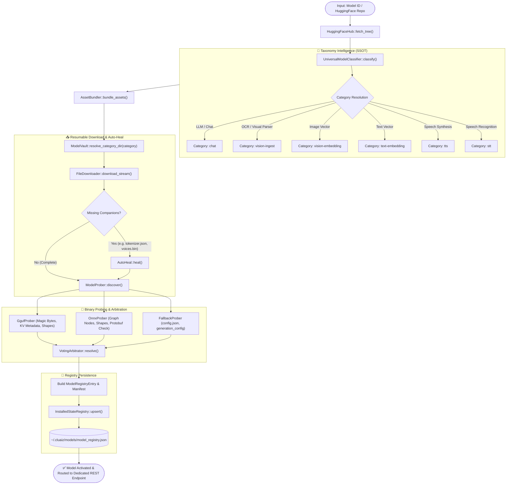
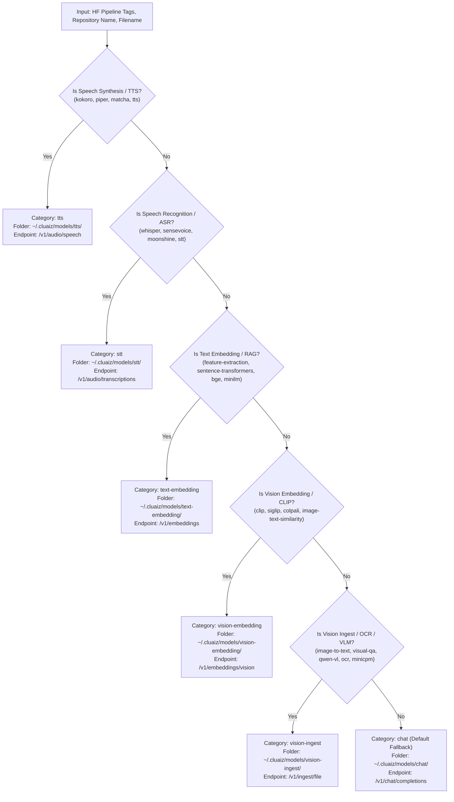

# 📦 Sovereign Model Subsystem (`engines/src/models/`)

> **The Single Source of Truth (SSOT) for Model Taxonomy, Binary Probing, Atomic Ingestion, Vault Storage, and REST Endpoint Routing across the Cluaiz Ecosystem.**

---

## 🌟 Executive Summary & Core Philosophy

The **Sovereign Model Subsystem** decouples raw model weights, format parsing (GGUF/ONNX), taxonomy classification, and disk storage from execution backends (LlamaCpp, ONNX Runtime, Candle, Custom Math Kernels).

### Key Architectural Pillars:
1. **Modular Sovereignty (Zero-Khichdi):** Every layer has single-responsibility boundaries. Taxonomy intelligence never touches disk I/O; binary probers never handle network requests; and downloaders never inspect model weights.
2. **Ironclad DRY Rule:** Shared taxonomy rules, quantization types, and family heuristics are defined once and hot-swapped across all crates.
3. **6 Sovereign Vault Folders:** Elimination of monolithic legacy folders. Models are deterministically partitioned into 6 domain-specific directories, each mapped to a dedicated OpenAI/Cluaiz-compatible REST endpoint.
4. **Deterministic Binary Truth:** Models are probed at the binary level (GGUF magic bytes & tensor KV / ONNX protobuf graph schemas) before ever entering the system registry.

---

## 🏛️ System Topology & 6-Layer Architecture

```
engines/src/models/
├── types/              -> [DOMAIN ENTITIES & DATA STRUCTURES]
│   ├── entities.rs        -> SlotType (6 Sovereign Categories), MemoryAllocation, ModelCategory
│   ├── manifest.rs        -> ModelManifest, ModelRegistryEntry, RegistryModelFile, RegistryModelMetadata
│   └── mod.rs             -> Type system facade
│
├── taxonomy/           -> [INTELLIGENCE LAYER (SSOT)]
│   ├── quantization.rs    -> Universal Quantization (1-bit, 1.58b, FP4/FP8, GGUF/AWQ/GPTQ) & Shard RegEx
│   ├── tts_families.rs    -> 10+ TTS Architectures (Kokoro, Piper, Supertonic, Matcha) & Protobuf Limits
│   ├── stt_families.rs    -> STT Architectures (Whisper, SenseVoice, Moonshine, Paraformer) & Priority Scoring
│   ├── rules.rs           -> UniversalTaskRules (Canonical slot capability mapping)
│   ├── classifier.rs      -> UniversalModelClassifier (Deterministic HuggingFace & metadata inference)
│   └── mod.rs             -> Taxonomy intelligence facade
│
├── prober/             -> [INSPECTION & ARBITRATION LAYER]
│   ├── gguf.rs            -> Zero-copy GGUF Header, KV metadata & Tensor shape extractor
│   ├── onnx.rs            -> ONNX Protobuf parser, ExecutionProvider detector & Input shape prober
│   ├── fallback.rs        -> Secondary Config.json / HuggingFace manifest parser
│   └── mod.rs             -> ModelProber::discover & 3-Way Voting Arbitrator
│
├── fetcher/            -> [ACQUISITION & AUTO-HEAL LAYER]
│   ├── downloader.rs      -> Resumable chunk downloader with atomic backoff, progress events & abort tokens
│   ├── auto_heal.rs       -> AutoHeal for missing companion files (tokenizers, phoneme lexicons, configs)
│   ├── hf_hub.rs          -> HuggingFace API client with multi-shard variant grouping (Zero duplicate entries)
│   ├── asset_bundler.rs   -> Companion asset resolver (.onnx.data, tokenizer.json, voices.bin) & Sovereign IDs
│   ├── client.rs          -> Remote Cluaiz registry client
│   └── mod.rs             -> Acquisition subsystem facade
│
├── registry/           -> [STATE & VAULT PERSISTENCE LAYER]
│   ├── vault.rs           -> ModelVault (Single Source of Truth for 6 Folders & Endpoints)
│   ├── installed_state.rs -> InstalledStateRegistry (Thread-safe atomic model_registry.json state manager)
│   ├── catalog.rs         -> ModelCatalog (Local library loader & dynamic hardware recommendation matrix)
│   ├── discovery.rs       -> AutonomousDiscovery (Local disk scanner, orphan recovery & DNA reconstructor)
│   ├── auditor.rs         -> Hardware RAM / VRAM dynamic fit auditor
│   ├── provisioner.rs     -> Download provisioning & prerequisite validator
│   └── mod.rs             -> Registry persistence facade
│
├── manager/            -> [LIFECYCLE ORCHESTRATOR]
│   └── mod.rs             -> ModelManager (Pull, Verify, Deep Probe, Auto-Heal, Register, Remove)
│
└── mod.rs              -> Sovereign Root Interface
```

---

## 🗂️ The 6 Sovereign Vault Folders & Dedicated Endpoints

Every model downloaded or discovered is assigned to exactly one of the **6 Sovereign Domains**:

| # | Domain Category | Local Vault Directory Path | Canonical REST API Endpoint | Supported Engine Backends | Primary Example Models |
|---|---|---|---|---|---|
| **1** | **`chat`** | `~/.cluaiz/models/chat/` | **`POST /v1/chat/completions`** | LlamaCpp, ONNX Runtime, Candle | Llama-3, Qwen-2.5, DeepSeek-R1, Gemma-2 |
| **2** | **`vision-ingest`** | `~/.cluaiz/models/vision-ingest/` | **`POST /v1/ingest/file`** | VisionParser, QwenVL Engine | Qwen2-VL, MiniCPM-V, Florence-2, OCR |
| **3** | **`vision-embedding`** | `~/.cluaiz/models/vision-embedding/` | **`POST /v1/embeddings/vision`** | ONNX Runtime (CUDA/DirectML) | CLIP-ViT, SigLIP, ColPali |
| **4** | **`text-embedding`** | `~/.cluaiz/models/text-embedding/` | **`POST /v1/embeddings`** | ONNX Runtime, Candle | BGE-M3, MiniLM-L6, Nomic-Embed, GTE |
| **5** | **`tts`** | `~/.cluaiz/models/tts/` | **`POST /v1/audio/speech`** | ONNX Runtime, Piper/Sherpa Native | Kokoro, Piper, Supertonic, Matcha |
| **6** | **`stt`** | `~/.cluaiz/models/stt/` | **`POST /v1/audio/transcriptions`** | WhisperEngine, Sherpa-ONNX | Whisper-Large-v3, SenseVoice, Moonshine |

---

## 🔄 End-to-End Model Ingestion & Verification Lifecycle

The diagram below illustrates the exact step-by-step pipeline executed when a model is pulled or discovered:



---

## 🧬 Taxonomy Classification Decision Flowchart

The following logic is executed by `UniversalModelClassifier` to deterministically map incoming models to the correct Sovereign Category without legacy cross-contamination:



---

## 🧩 Detailed Subsystem Technical Specifications

### 1. `types/` — Domain Types & Data Contracts
- **`entities.rs`:** Defines `SlotType` corresponding directly to the sovereign engine slots (`ChatSlot`, `VisionSlot`, `VisionEmbedSlot`, `TextEmbedSlot`, `TtsSlot`, `SttSlot`), hardware allocation descriptors, and memory configuration flags.
- **`manifest.rs`:** Defines the persistence schemas:
  - `ModelManifest`: Canonical bundle metadata stored locally as `model_manifest.json` inside each model folder.
  - `ModelRegistryEntry`: Synchronized in-memory and on-disk representation stored inside `~/.cluaiz/models/model_registry.json`.
  - `RegistryModelFile`: Exact file-level metrics (primary weight flag, byte size, file hash, companion role).

---

### 2. `taxonomy/` — The Intelligence Engine
- **`quantization.rs`:** Single Source of Truth for quantization intelligence across the engine.
  - Parses 1-bit (`IQ1_S`, `BitNet 1.58b`), FP4/FP8 (`E4M3`, `E5M2`), standard GGUF quantizations (`Q4_K_M`, `Q5_K_S`, `Q8_0`), and ONNX quantization suffixes (`_quantized.onnx`, `_int8.onnx`).
  - Regex pattern matching for multi-shard weight distributions (`-00001-of-00003.gguf`).
- **`tts_families.rs`:** Expert taxonomy for 10+ speech synthesis architectures:
  - `Kokoro`: Requires `voices.bin` or `voices/` subfolder, multi-lingual style vectors.
  - `Piper`: Requires `.onnx.json` config containing phoneme synthesis graphs.
  - `Matcha / Supertonic`: Handles external weight separation when ONNX exceeds the 1.8GB Protobuf limit (`model.onnx.data`).
- **`stt_families.rs`:** Expert taxonomy for automatic speech recognition:
  - `Whisper`: Scores GGUF vs ONNX variants, detects encoder/decoder split weights.
  - `SenseVoice / Moonshine`: Detects fast transcription tokenizers and CTC graphs.
- **`classifier.rs`:** Deterministic, rule-driven tag and token classifier (`UniversalModelClassifier`).

---

### 3. `prober/` — Binary Inspection & 3-Way Arbitration
- **`gguf.rs` (`GgufProber`):** Reads binary GGUF headers without loading the full model into memory.
  - Validates GGUF magic bytes (`0x46554747`).
  - Extracts model architecture (`llama`, `qwen2`, `clip`, `whisper`), context window length (`context_length`), block counts, and tensor KV shapes.
- **`onnx.rs` (`OnnxProber`):** Inspects ONNX graph definitions:
  - Extracts input/output tensor shapes and data types.
  - Detects multi-file ONNX weights (`.onnx.data`) and verifies data integrity.
- **`fallback.rs` (`FallbackProber`):** Secondary inspector reading `config.json`, `generation_config.json`, and `tokenizer_config.json`.
- **`mod.rs` (`VotingArbitrator`):** Executes 3-way arbitration among Binary Prober, Fallback Inspector, and Taxonomy Classifier to guarantee 100% classification accuracy.

---

### 4. `fetcher/` — Ingestion & Autonomous Auto-Heal
- **`downloader.rs` (`FileDownloader`):** High-throughput asynchronous HTTP stream downloader with:
  - Atomic `.part` file creation to prevent corrupted partial weights.
  - Tokio mpsc progress event emission.
  - Atomic abort tokens (`Arc<AtomicBool>`) and exponential backoff retry.
- **`hf_hub.rs` (`HuggingFaceHub`):** Aggregates HuggingFace repository file trees into clean, unified variants. Eliminates duplicate listings for multi-shard models (`-00001-of-00004.gguf`).
- **`asset_bundler.rs` (`AssetBundler`):** Resolves primary weights together with required companion assets (`tokenizer.json`, `config.json`, `voices.bin`, `.onnx.data`).
- **`auto_heal.rs` (`AutoHeal`):** Automatically detects missing companion files during model discovery or download, and fetches required assets autonomously from HuggingFace.

---

### 5. `registry/` — Vault Persistence & State Management
- **`vault.rs` (`ModelVault`):** The Single Source of Truth for folder paths and REST endpoints across the workspace:
  ```rust
  ModelVault::chat_dir()             // ~/.cluaiz/models/chat
  ModelVault::vision_ingest_dir()    // ~/.cluaiz/models/vision-ingest
  ModelVault::vision_embedding_dir() // ~/.cluaiz/models/vision-embedding
  ModelVault::text_embedding_dir()   // ~/.cluaiz/models/text-embedding
  ModelVault::tts_dir()              // ~/.cluaiz/models/tts
  ModelVault::stt_dir()              // ~/.cluaiz/models/stt
  ```
- **`installed_state.rs` (`InstalledStateRegistry`):** Manages `~/.cluaiz/models/model_registry.json` using atomic file writes with file locking to ensure concurrency safety.
- **`discovery.rs` (`AutonomousDiscovery`):** Scans the 6 sovereign folders on system startup, reconstructs missing `model_registry.json` entries directly from binary headers, and purges orphaned artifacts.
- **`catalog.rs` (`ModelCatalog`):** Provides curated model recommendations tailored to available system RAM, VRAM, and CPU SIMD capabilities.

---

### 6. `manager/` — Lifecycle Orchestration
- **`ModelManager`:** Orchestrates the entire lifecycle:
  - `pull_model(&model_id)`: Fetches metadata, classifies taxonomy, bundles companions, downloads to sovereign folder, runs deep binary probing, and persists state to `model_registry.json`.
  - `remove_model(&model_id)`: Safely removes physical assets from disk, unregisters from active slots, and updates the registry.

---

## 🛡️ Engineering Invariants & Quality Assurance

1. **Zero Legacy References:** No code in the inference engine may reference deprecated monolithic `audio/` or generic `embedding/` folders.
2. **Absolute DRY Law:** Any quantization pattern, TTS family check, or STT parsing rule used more than once MUST reside inside `taxonomy/`.
3. **No Unsafe Fallbacks:** If a model cannot be deterministically classified or probed, it fails safely with structured telemetry rather than guessing.
4. **Resilience to Incomplete Downloads:** Models with incomplete `.part` files or missing primary weights are never registered in `model_registry.json`.
