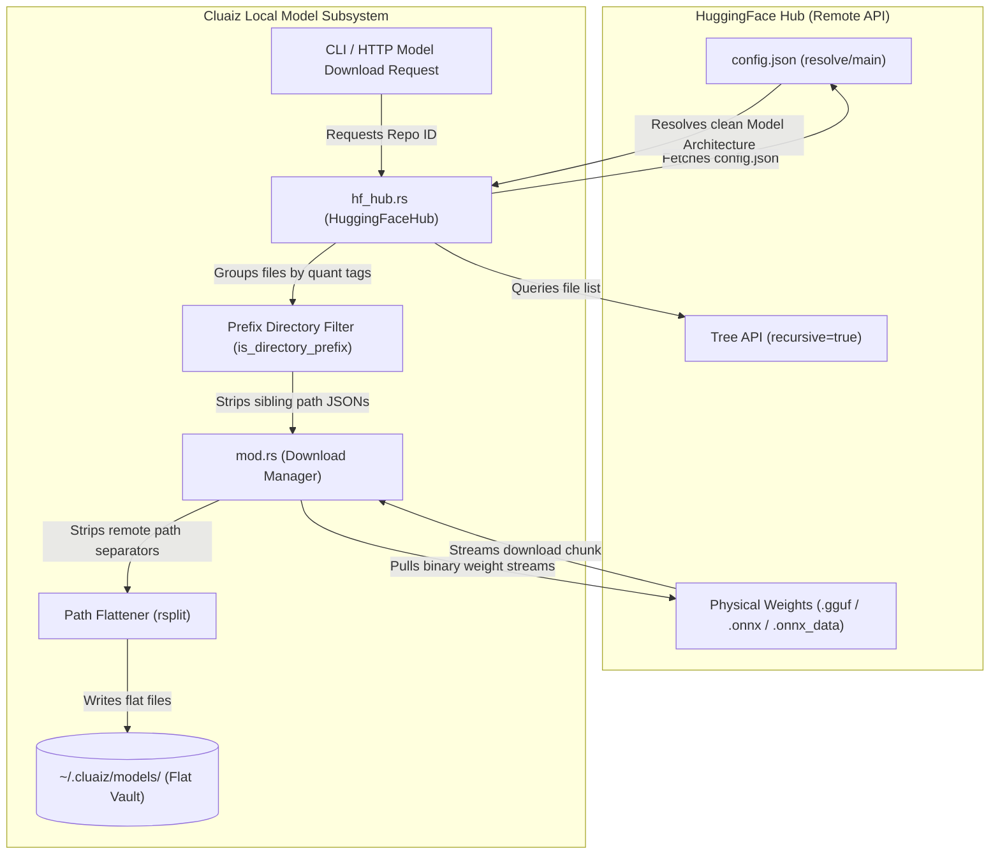
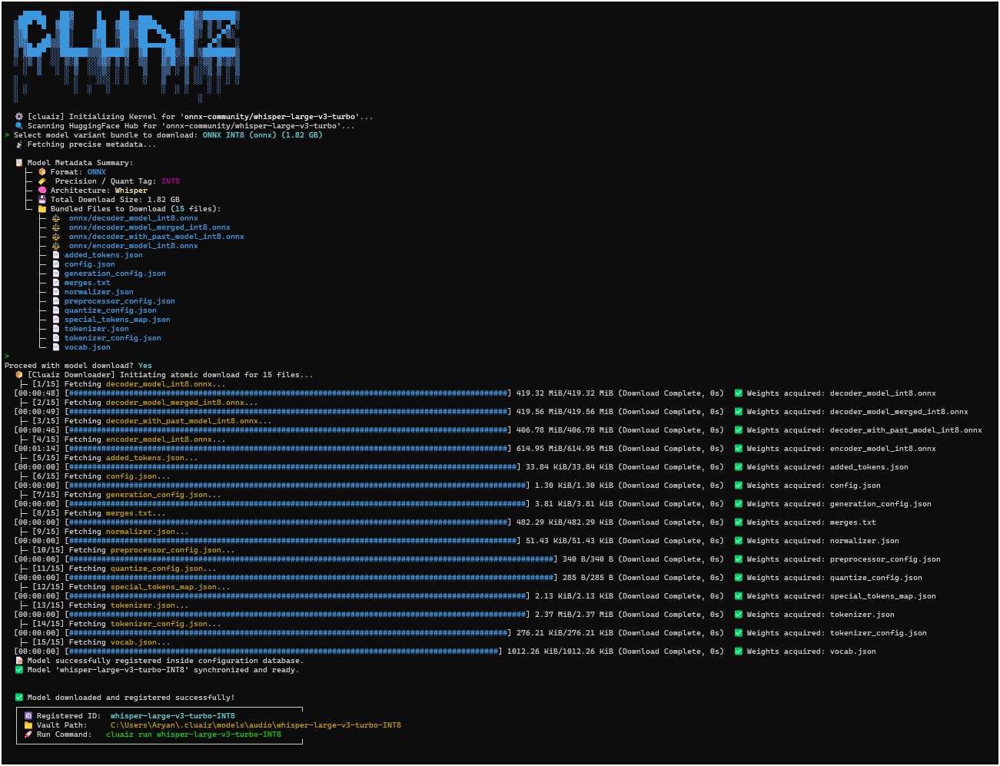

# 📦 Local Model Subsystem (`engines/src/models/`)

This directory implements the central model management, registration, and fetching logic of the Cluaiz Engine. It is responsible for cataloging models on local disk, parsing variant configurations, dynamically resolving model architecture metadata, and atomic network retrieval with local directory flattening.

## Technical Specification
- **Purpose:** Decouples model storage logic, HuggingFace metadata resolution, and atomic multi-threaded chunk downloading from inference execution runtimes.
- **Platform Support:** Cross-platform (Windows, Linux, macOS).
- **Reusability Level:** Core subsystem used by CLI runner, HTTP server handlers, and the dispatch broker.

---

## 🏛️ System Architecture & Data Flow

Below is the detailed operational lifecycle of a HuggingFace repository pull request, demonstrating how variants are dynamically mapped, filtered, and saved into a flat local vault structure:

### HuggingFace Model Downloader UI Interface
Below is the execution flow showing the dynamic bundle parsing and the file structure view presented to the user prior to execution:

---

## API Contract (Interface)

- **Registry Core Type:** `pub struct ModelRegistry` (maintains active local inventory)
- **Manifest Contract:** `pub struct ModelManifest` (describes model capabilities, tokenizer, context size, and weights mapping)
- **Downloader Interface:** `pub struct ModelDownloader` (handles HTTP chunk streaming and resume states)
- **FFI / C-Export:** Private Rust modules compiled directly into the Cluaiz engine framework.
- **Key Dependencies:**
  - `reqwest`: Asynchronous streaming client for file downloads.
  - `serde_json`: Manifest serialization and API model response parsing.
  - `tokio`: Async I/O runtime integration.
  - `cluaiz-shared`: Lower-level utility libraries for binary probing (GGUF file headers).

---

## Deep File Breakdown

### 1. `manager/` (Variant Mapping and Downloading Orchestrator)
- [`hf_hub.rs`](file:///c:/Users/Aryan/my/Cluaiz-workspace/Cluaiz-Technologies/cluaiz/inference-engine/engines/src/models/manager/hf_hub.rs)
  - **Logic:** Queries the remote HuggingFace repository using recursive tree APIs. Automatically parses repository files to group them into cohesive bundles based on quantization formats (GGUF, ONNX).
  - **Dynamic Fallbacks:** Directly fetches the remote repository's `config.json` via HTTP `resolve` endpoint to parse the `model_type` or `architectures` tag, ensuring the correct architecture (e.g. `Whisper`, `Gemma`, `Qwen`) is resolved pre-download.
  - **Metadata Isolation:** Implements `is_directory_prefix` to filter harvested JSON files, ensuring that a user selecting a specific execution provider (e.g. `Q4_K_M/cuda/decoder/`) only downloads config files on that prefix path, discarding duplicate files from sibling branches (e.g. `Q4_K_M/default/`).
- [`mod.rs`](file:///c:/Users/Aryan/my/Cluaiz-workspace/Cluaiz-Technologies/cluaiz/inference-engine/engines/src/models/manager/mod.rs)
  - **Logic:** Performs the execution wrapper `pull_model_bundle_with_manifest`.
  - **Flat Path Storage:** Mutates the manifest ID during the download phase and strips remote path directory components (`rsplit('/')`) when writing files locally. This enforces a flat local directory vault structure (e.g. `models/chat/GLM-5.2-GGUF-UD-IQ1_S/`) instead of nested, hard-to-parse folder structures.
- [`installer.rs`](file:///c:/Users/Aryan/my/Cluaiz-workspace/Cluaiz-Technologies/cluaiz/inference-engine/engines/src/models/manager/installer.rs)
  - **Logic:** Wraps weights download instructions and handles localized installation targets.
- [`auditor.rs`](file:///c:/Users/Aryan/my/Cluaiz-workspace/Cluaiz-Technologies/cluaiz/inference-engine/engines/src/models/manager/auditor.rs)
  - **Logic:** Audits local model directories to verify integrity and detect corrupt file locks.

### 2. `fetch/` (Network Transport Subsystem)
- [`mod.rs`](file:///c:/Users/Aryan/my/Cluaiz-workspace/Cluaiz-Technologies/cluaiz/inference-engine/engines/src/models/fetch/mod.rs)
  - **Logic:** Implements the `ModelDownloader` core stream wrapper.
  - **Flow:** Spawns async HTTP streams, chunking downloads into disk blocks. Calculates hash integrity verification buffers.

### 3. `registry/` (Metadata Catalog & Discovery)
- [`discovery.rs`](file:///c:/Users/Aryan/my/Cluaiz-workspace/Cluaiz-Technologies/cluaiz/inference-engine/engines/src/models/registry/discovery.rs)
  - **Logic:** Discovers models on startup by scanning local workspace directories.
- [`mod.rs`](file:///c:/Users/Aryan/my/Cluaiz-workspace/Cluaiz-Technologies/cluaiz/inference-engine/engines/src/models/registry/mod.rs)
  - **Logic:** Maintains the active SQLite or JSON-backed system manifest indexes.

---

## Failure & Recovery Logic

### 1. Partial/Corrupted Downloads
- **Failure Point:** Network disconnection or power loss mid-download leaves massive model files partially written and corrupted.
- **Recovery Logic:** The network loop utilizes Byte-Range headers (`Range: bytes=X-`) to verify already written file offsets on disk, skipping successfully downloaded blocks and resuming only the remaining stream.

### 2. Duplicate Tokenizer / Configuration Mismatch
- **Failure Point:** A model repository containing both ONNX CPU and ONNX CUDA variants writes identical filenames (`tokenizer.json`, `genai_config.json`) into the local model folder, overwriting and corrupting runtime parameters.
- **Recovery Logic:** The Prefix Directory filtering logic dynamically isolates file structures during the variant compilation step. Sibling configs are skipped, and files are written to variant-specific local folders, avoiding conflicts completely.

### 3. Remote HuggingFace API Rate Limiting (HTTP 429)
- **Failure Point:** Frequent repository tree lookups or metadata probing requests cause HuggingFace to temporarily block the user's IP.
- **Recovery Logic:** Direct `config.json` probing is only triggered if standard metadata fields are missing. The fetched metadata is immediately compiled into a local `manifest.json` file inside the local model vault, ensuring zero redundant API calls after a model has been registered once.
