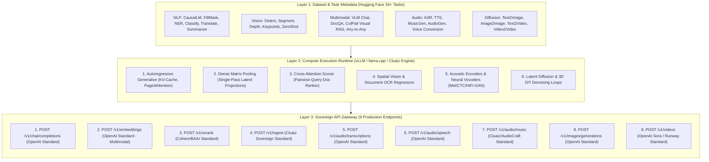
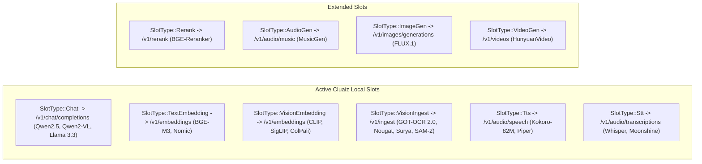
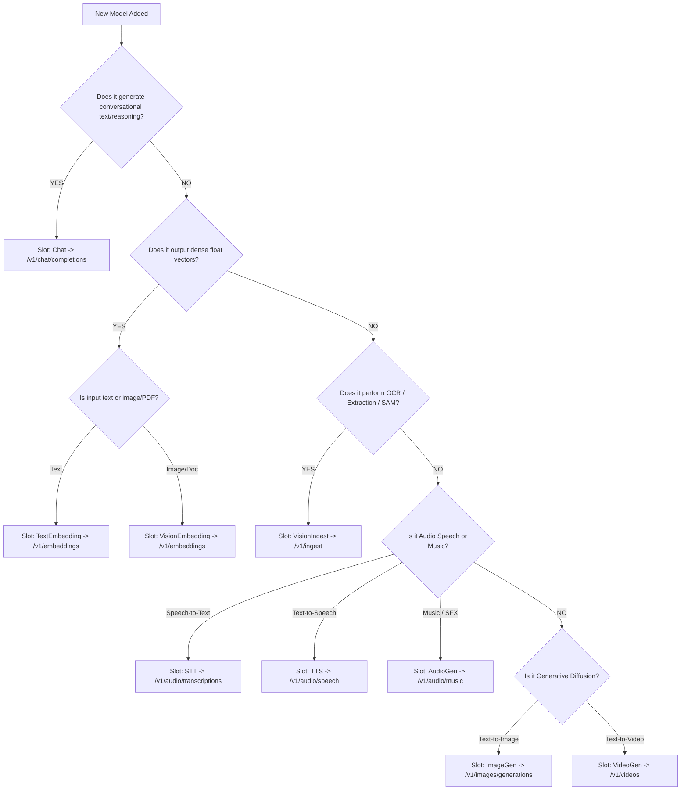

# 🏛️ Cluaiz Sovereign Engine: API Endpoints & Universal AI Taxonomy Reference Guide

> **Target Module:** `cluaiz/inference-engine/engines/src/models/`  
> **Status:** Definitive Source of Truth (SSOT)  
> **Audience:** Core Maintainers, Open-Source Contributors, Inference Engineers  
> **Foundational Standards:** OpenAI REST Specification, Hugging Face Hub Tasks (`huggingface.co/tasks`), vLLM Runtime Specifications, and Cluaiz Sovereign Local Engine Architecture.

---

## 📑 Table of Contents

1. [Architectural Philosophy: The 3 Core AI Layers](#1-architectural-philosophy-the-3-core-ai-layers)
2. [Master 9-Endpoint Sovereign Matrix](#2-master-9-endpoint-sovereign-matrix)
3. [Deep Endpoint Technical Specifications](#3-deep-endpoint-technical-specifications)
   - [1. `/v1/chat/completions` (Conversational LLM & VLM)](#1-v1chatcompletions-conversational-llm--vlm)
   - [2. `/v1/embeddings` (Multimodal Dense Vectors & Search)](#2-v1embeddings-multimodal-dense-vectors--search)
   - [3. `/v1/rerank` (Cross-Encoder Document Scoring)](#3-v1rerank-cross-encoder-document-scoring)
   - [4. `/v1/ingest` (Specialized Document AI & Spatial Vision)](#4-v1ingest-specialized-document-ai--spatial-vision)
   - [5. `/v1/audio/transcriptions` (Speech-to-Text ASR)](#5-v1audiotranscriptions-speech-to-text-asr)
   - [6. `/v1/audio/speech` (Neural Voice Synthesis TTS)](#6-v1audiospeech-neural-voice-synthesis-tts)
   - [7. `/v1/audio/music` (Generative Music & Sound Effects)](#7-v1audiomusic-generative-music--sound-effects)
   - [8. `/v1/images/generations` (Latent Diffusion Text-to-Image)](#8-v1imagesgenerations-latent-diffusion-text-to-image)
   - [9. `/v1/videos` (Async Temporal Video Diffusion)](#9-v1videos-async-temporal-video-diffusion)
4. [Cluaiz Sovereign Slot Allocation Matrix](#4-cluaiz-sovereign-slot-allocation-matrix)
5. [Contributor & Engineering Decision Tree](#5-contributor--engineering-decision-tree)

---

# 1. Architectural Philosophy: The 3 Core AI Layers

Hamari architecture 3 strict layers me divide hoti hai jo data aur compute execution ko seamlessly connect karti hain:



---

# 2. Master 9-Endpoint Sovereign Matrix

> **Core Rule:** **Zero Duplication / Zero Khichdi.** Har Hugging Face task tag ka sirf aur sirf **EK HI sovereign endpoint** hota hai.

| # | HTTP Route | Core Execution Paradigm | Mapped Hugging Face Task Tags | Flagship Open-Weight Models |
|---|---|---|---|---|
| **1** | **`/v1/chat/completions`** | Autoregressive Token Generation (KV-Cache) | `text-generation`, `chat-completion`, `image-text-to-text`, `image-to-text`, `video-text-to-text`, `audio-text-to-text`, `visual-question-answering`, `summarization`, `translation`, `any-to-any` | `Qwen2.5-7B`, `Qwen2-VL-7B`, `Llama-3.3-70B`, `DeepSeek-V3`, `Florence-2`, `Ultravox` |
| **2** | **`/v1/embeddings`** | Bidirectional Matrix Pooling (Multimodal) | `sentence-similarity`, `feature-extraction`, `text-classification`, `token-classification`, `fill-mask`, `multiple-choice`, `question-answering`, `zero-shot-image-classification`, `image-feature-extraction`, `visual-document-retrieval`, `keypoint-matching` | `BGE-M3`, `Nomic-Embed`, `CLIP ViT-L/14`, `SigLIP`, `ColPali v1.2`, `DINOv2` |
| **3** | **`/v1/rerank`** | Cross-Encoder Full Pairwise Attention Head | `text-ranking` | `BGE-Reranker-v2-M3`, `Cohere-Rerank-v3` |
| **4** | **`/v1/ingest`** | Spatial Vision, OCR & Polygon Regressors | `document-ocr`, `document-question-answering`, `table-extraction`, `object-detection`, `zero-shot-object-detection`, `mask-generation`, `image-segmentation`, `instance-segmentation`, `depth-estimation`, `keypoint-detection` | `GOT-OCR 2.0`, `Nougat`, `Table Transformer`, `DETR`, `SAM-2`, `Depth-Anything-V2` |
| **5** | **`/v1/audio/transcriptions`** | Acoustic Mel-Spectrogram & ASR Decoder | `automatic-speech-recognition`, `audio-classification` | `Whisper Large-v3-Turbo`, `Moonshine`, `SenseVoiceSmall` |
| **6** | **`/v1/audio/speech`** | Text Normalizer + Acoustic Neural Vocoder | `text-to-speech`, `voice-synthesis` | `Kokoro-82M`, `Piper-TTS`, `Suno Bark`, `MeloTTS` |
| **7** | **`/v1/audio/music`** | Autoregressive Audio Codec Diffusion | `text-to-audio`, `sound-effects`, `audio-to-audio` | `Meta MusicGen`, `AudioGen`, `Stable Audio Open`, `Demucs` |
| **8** | **`/v1/images/generations`** | Multi-step Latent Diffusion Denoising Loop | `text-to-image`, `image-to-image`, `unconditional-image-generation` | `FLUX.1-schnell`, `SDXL 1.0`, `SD3.5 Large` |
| **9** | **`/v1/videos`** | 3D Spatial-Temporal DiT Video Diffusion | `text-to-video`, `image-to-video`, `video-to-video` | `Tencent HunyuanVideo`, `CogVideoX-5B`, `Mochi-1` |

---

# 3. Deep Endpoint Technical Specifications

---

## 1. `/v1/chat/completions` (Conversational LLM & VLM)

### 🎯 Objective:
Multi-turn conversational dialogue with system prompts, function calling, tool use, visual understanding, temporal video analysis, and real-time streaming tokens.

### 📥 Request Schema:
```json
{
  "model": "qwen2.5-7b-instruct",
  "messages": [
    { "role": "system", "content": "You are Cluaiz AI Architect." },
    {
      "role": "user",
      "content": [
        { "type": "text", "text": "Analyze this architecture diagram." },
        { "type": "image_url", "image_url": { "url": "data:image/jpeg;base64,..." } }
      ]
    }
  ],
  "stream": true,
  "temperature": 0.7,
  "max_tokens": 4096
}
```

### 📤 Response Schema:
```json
{
  "id": "chatcmpl-901a88",
  "object": "chat.completion",
  "created": 1724056800,
  "model": "qwen2.5-7b-instruct",
  "choices": [
    {
      "index": 0,
      "message": {
        "role": "assistant",
        "content": "The architecture diagram defines a 3-layer decoupled compute topology..."
      },
      "finish_reason": "stop"
    }
  ],
  "usage": { "prompt_tokens": 340, "completion_tokens": 128, "total_tokens": 468 }
}
```

---

## 2. `/v1/embeddings` (Multimodal Dense Vectors & Search)

### 🎯 Objective:
Text sequences, Code chunks, Images, aur Scanned Document pages ko dense float vectors me encode karna for semantic similarity and visual RAG. **Zero text generation.**

### 📥 Request Schema (Text & Visual Inputs):
```json
{
  "model": "bge-m3",
  "input": [
    "What is the memory bandwidth of NVIDIA RTX 4090?",
    { "type": "image_url", "image_url": "data:image/png;base64,..." }
  ],
  "dimensions": 1024,
  "encoding_format": "float"
}
```

### 📤 Response Schema:
```json
{
  "object": "list",
  "data": [
    { "object": "embedding", "index": 0, "embedding": [0.0234, -0.0512, "...1024 floats"] },
    { "object": "embedding", "index": 1, "embedding": [0.0891, -0.0122, "...1024 floats"] }
  ],
  "usage": { "prompt_tokens": 28, "total_tokens": 28 }
}
```

---

## 3. `/v1/rerank` (Cross-Encoder Document Scoring)

### 🎯 Objective:
First-stage vector search ke candidate documents ko query ke sath cross-attention feed karke exact relevance scores rank karna.

### 📥 Request Schema:
```json
{
  "model": "bge-reranker-v2-m3",
  "query": "How to write low-overhead SIMD kernels in Rust?",
  "documents": [
    "SIMD instructions enable data-level parallelism via specialized CPU vector registers.",
    "Python multiprocessing module documentation."
  ],
  "top_n": 1
}
```

### 📤 Response Schema:
```json
{
  "results": [
    { "index": 0, "relevance_score": 0.9842, "document": { "text": "SIMD instructions enable..." } }
  ]
}
```

---

## 4. `/v1/ingest` (Specialized Document AI & Spatial Vision)

### 🎯 Objective:
**Yeh Chat models NAHI hain.** Images, Scanned Invoices, PDFs, aur blueprints ko ingest karke **Structured Data (Clean Markdown, JSON Tables, SAM Cutout Masks, Bounding Boxes, Depth Maps)** extract karna.

### 📥 Request Schema:
```json
{
  "model": "got-ocr-2.0",
  "image": "data:image/png;base64,...",
  "task": "document_ocr",
  "parameters": { "format": "clean_markdown" }
}
```

### 📤 Response Schema:
```json
{
  "task": "document_ocr",
  "markdown": "# INVOICE #8940\n| Item | Qty | Total |\n| Server Rack | 2 | $4500 |",
  "tables": [{ "rows": 2, "cols": 3, "data": [["Item", "Qty", "Total"]] }],
  "bounding_boxes": [
    { "label": "header", "box": [10, 12, 450, 60], "confidence": 0.99 }
  ]
}
```

---

## 5. `/v1/audio/transcriptions` (Speech-to-Text ASR)

### 🎯 Objective:
Microphone audio files ya speech chunks ko transcribed text, multilingual translation, aur word-level timestamps me convert karna.

### 📥 Request Schema:
```http
POST /v1/audio/transcriptions
Content-Type: multipart/form-data

file: <audio_binary.wav>
model: whisper-large-v3-turbo
language: en
response_format: verbose_json
timestamp_granularities: ["word", "segment"]
```

### 📤 Response Schema:
```json
{
  "text": "Welcome to Cluaiz Sovereign Engine.",
  "language": "english",
  "duration": 2.45,
  "words": [
    { "word": "Welcome", "start": 0.00, "end": 0.42 },
    { "word": "to", "start": 0.44, "end": 0.58 },
    { "word": "Cluaiz", "start": 0.60, "end": 1.10 }
  ]
}
```

---

## 6. `/v1/audio/speech` (Neural Voice Synthesis TTS)

### 🎯 Objective:
Text string ko high-fidelity human voice waveform me synthesize karna with voice style profile and speed controls.

### 📥 Request Schema:
```json
{
  "model": "kokoro-82m",
  "input": "Welcome to Cluaiz Sovereign Engine. All systems operational.",
  "voice": "af_bella",
  "speed": 1.0,
  "response_format": "wav"
}
```

### 📤 Response Schema:
Binary Audio Buffer (`audio/wav` or `audio/pcm` at 24kHz / 44.1kHz).

---

## 7. `/v1/audio/music` (Generative Music & Sound Effects)

### 🎯 Objective:
Text prompts se full instrumental music tracks, ambient sound effects (SFX), aur audio-to-audio stem isolation generate karna.

### 📥 Request Schema:
```json
{
  "model": "musicgen-large",
  "prompt": "An atmospheric cyberpunk synthwave track with heavy basslines, 120 bpm",
  "duration_seconds": 30,
  "output_format": "wav"
}
```

### 📤 Response Schema:
```json
{
  "audio_url": "https://api.cluaiz.com/artifacts/audio_gen_892.wav",
  "duration_seconds": 30.0,
  "sample_rate": 32000
}
```

---

## 8. `/v1/images/generations` (Latent Diffusion Text-to-Image)

### 🎯 Objective:
Text descriptions se photorealistic images aur digital art synthesize karna via multi-step latent diffusion. **Fast, synchronous response (1-5s).**

### 📥 Request Schema:
```json
{
  "model": "flux-1-schnell",
  "prompt": "Futuristic brutalist server room glowing with neon emerald fiber optic cables, 8k resolution",
  "size": "1024x1024",
  "steps": 4,
  "response_format": "url"
}
```

### 📤 Response Schema:
```json
{
  "created": 1724056800,
  "data": [
    { "url": "https://api.cluaiz.com/artifacts/flux_render_01.png" }
  ]
}
```

---

## 9. `/v1/videos` (Async Temporal Video Diffusion)

### 🎯 Objective:
Text prompts aur static images se continuous temporal video sequences (50-200 frames) synthesize karna. **Heavy GPU compute - strictly Asynchronous Job Endpoint.**

### 📥 Request Schema (Step 1: Allocation):
```json
{
  "model": "hunyuan-video",
  "prompt": "Cinematic drone shot flying through a neon cyberpunk Tokyo in the rain, hyperrealistic, 4k",
  "duration_seconds": 5,
  "fps": 24
}
```

### 📤 Immediate Allocation Response:
```json
{
  "id": "vid_job_99218a",
  "status": "processing",
  "progress_percentage": 10,
  "poll_url": "/v1/videos/vid_job_99218a"
}
```

### 📤 Polling Response (`GET /v1/videos/vid_job_99218a`):
```json
{
  "id": "vid_job_99218a",
  "status": "completed",
  "video_url": "https://api.cluaiz.com/artifacts/render_99218a.mp4",
  "duration": 5.0,
  "resolution": "1280x720"
}
```

---

# 4. Cluaiz Sovereign Slot Allocation Matrix

Cluaiz Local Engine (`cluaiz/inference-engine/engines/`) local hardware par run hone waale models ko 6 Core Slots me isolate karta hai:



---

# 5. Contributor & Engineering Decision Tree

Agar koi contributor naya model add kar raha hai, toh yeh decision tree follow kare:


