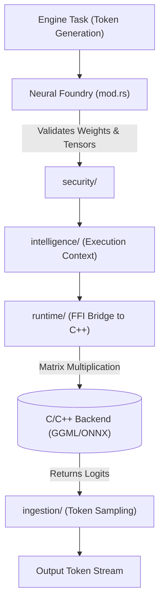

# 🧠 Neural Foundry (`engines/src/neural_foundry/`)

<strong>The Low-Level Math & Inference Backend Bridge</strong>

---

## 🎯 Deep Purpose

The `neural_foundry/` module is the heavy-lifting math execution layer of the Engine. While outer layers handle routing, HTTP requests, and structural DNA, the Neural Foundry is strictly responsible for performing tensor matrix multiplications. 

It acts as a secure, memory-safe Rust wrapper around highly optimized C/C++ backends (like `llama.cpp` for GGML or `onnxruntime` for ONNX). It ensures that a segmentation fault in a C++ tensor operation does not crash the entire Axum web gateway.

## 🏛️ Architectural Flow

## 🧬 Significant Subsystems

### 1. `runtime/`
- **The Core Logic:** Holds the unsafe FFI (Foreign Function Interface) bindings to the external C/C++ libraries.
- **The "Why":** Rust is memory safe; C++ is not. This module isolates all `unsafe {}` blocks required to pass raw memory pointers of the loaded LLM weights into the execution backend. 

### 2. `intelligence/`
- **The Core Logic:** Manages the active context window state during inference and resolves dynamic skill triggers.
- **The "Why":** When streaming a 32k context conversation, the engine must keep track of KV (Key-Value) attention states. Additionally, it reads model configuration variables via the dynamic active slots system to verify features like reasoning (`supports_thinking`), sliding window attention patterns, and custom JIT compilation configurations.

### 3. `ingestion/`
- **The Core Logic:** Post-processing of mathematical logits. Handles Top-K, Top-P, and Temperature sampling.
- **The "Why":** The math backend only returns a raw array of probability floats (logits). The `ingestion/` module converts those raw probabilities back into actual text tokens by applying the user's selected sampling algorithms.

### 4. `security/`
- **The Core Logic:** Validates neural weights, controls execution access, and manages active model slots configuration.
- **The "Why":** Under the **vLLM-Grade Active Slots Specification** ([permission_schema.rs](file:///c:/Users/Aryan/my/Cluaiz-workspace/Cluaiz-Technologies/cluaiz/inference-engine/engines/src/neural_foundry/security/permission_schema.rs)), this module validates loaded model architectures and tags them with their corresponding `supported_tasks`. This prevents malicious model injections and enforces strict pre-flight guardrails (rejecting HTTP 400 Bad Request if an embedding model is targeted for a text-generation task, safeguarding GPU VRAM from corruption).

### 5. `registry/`
- **The Core Logic:** Controls Sovereign Roster Discovery and Cache Synchronization.
- **The "Why":** Scans local paths dynamically to map capabilities (`has_vision`, `has_audio`) to active slots, updating `permission.json` dynamically when a model is selected.
