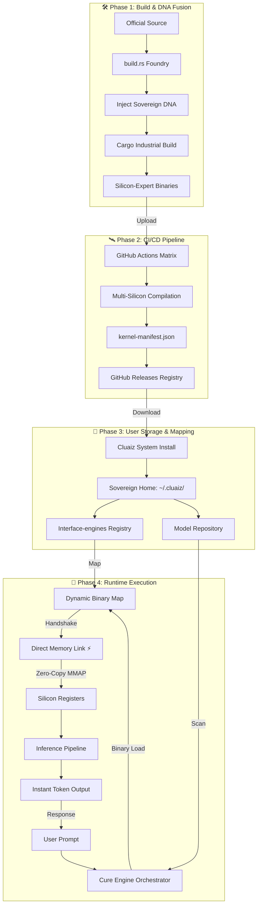

# Cluaiz Interface Engines (The Foundry)
**The Neural Interface-engines: From Source to Silicon Intelligence**

## 🎯 1. THE GOAL: WHY CLUAIZ?
Most AI systems (Ollama, vLLM, etc.) operate as **"Wrappers"**. They rely on external Python runtimes and heavy IPC (Inter-Process Communication) protocols like HTTP/JSON, which introduce significant serialization overhead.

**Our Goal**: To build a **Neural Interface-engine** that establishes a direct handshake with the silicon. By eliminating the "Efficiency Tax" (Python, Docker, IPC), Cluaiz runs natively on every OS from Android to Windows. There is no communication layer between the engine and the orchestrator—they operate within the same process memory space for maximum throughput.

---

## 🧬 2. THE "DNA": HANDSHAKE & PROTOCOL
This is the core architecture that transforms a raw binary into a "Sovereign Engine."

### **A. `archer-shared` (The Sovereign Dictionary)**
Imagine Cluaiz-OS as a **Space Station** and an engine like `llama.cpp` as an external **Robot**. For the robot to function on the station, both must speak the exact same language.
- **What is it?**: A Rust crate that defines the **"Common Language"** for the entire ecosystem.
- **Why?**: It contains the **Traits (Rules)** that every engine must implement (e.g., `generate()`, `load()`, `unload()`).
- **Mechanism**: When an engine is compiled, it links to `archer-shared` so it knows exactly what the Cluaiz Orchestrator expects from it.

### **B. `archer_kernel_init` (The Sovereign Handshake)**
This is the "Identity Card" and the "Secret Entrance" of every engine.
- **What is it?**: A specialized function exported within every `.so` or `.dll` binary.
- **How it works?**: When the `cluaiz-cure` (Orchestrator) maps a binary from the SSD into memory, it searches for a single symbol: `archer_kernel_init`.
- **The Result**: Once found, a **Direct Memory Pointer** is established between the engine and the OS. This eliminates the need for APIs or intermediate protocols, allowing the engine to activate instantly.

---

## 📂 3. FOLDER ARCHITECTURE & FILE MISSION

Every file has a specific neural purpose:

```text
interface-engines
├── 📁 candle/ (The Universal Engine)
│   ├── 📁 src/
│   │   ├── 🦀 bit_linear.rs # 🧱 BitNet Core: Native ternary math (-1, 0, 1) logic.
│   │   ├── 🦀 config.rs     # ⚙️ Architecture: Defines bit-depth (1.0b vs 1.58b).
│   │   ├── 🦀 infer.rs      # ⚡ Inference Core: Main execution logic for Rust models.
│   │   ├── 🦀 lib.rs        # 🤝 Entry Point: Handles the Sovereign Handshake.
│   │   └── 🦀 loader.rs     # 🚚 Weight Loader: Maps weights from the Sovereign Vault.
│   ├── ⚙️ Cargo.toml         # 📦 Features: CUDA, Metal, and BitNet toggles.
│   └── 🦀 build.rs          # 🛠️ Foundry: Prepares official HuggingFace source.
│
├── 📁 llama/ (The GGUF Speedster)
│   ├── 📁 src/
│   │   ├── 🦀 asm_kernels.rs # 🔥 The Nitro: Hand-written Assembly for AVX-512/Metal.
│   │   ├── 🦀 bridge.rs      # Bridge: Links Rust logic to raw C++ pointers.
│   │   ├── 🦀 config.rs      # ⚙️ Hyper-params: Context length and layer settings.
│   │   ├── 🦀 lib.rs         # 🤝 Entry Point: The C-ABI Handshake gateway.
│   │   ├── 🦀 loader.rs      # 🚚 SSD-to-Silicon: Zero-copy weight mapping.
│   │   ├── 🦀 pipeline.rs    # 🔄 Loop: Manages token prefill and generation.
│   │   └── 🦀 router.rs      # 🚦 Router: Dynamically picks CUDA/Metal/Vulkan.
│   ├── ⚙️ Cargo.toml          # 📦 Raw C++ Bridge configuration.
│   └── 🦀 build.rs           # 🛠️ Commander: Clones/Compiles ggml-org source.
└── ⚙️ Cargo.toml (Workspace Root)
```

---

## 🏗️ 4. STRATEGY B: THE "FOUNDRY" FUSION (OFFICIAL CODE + DNA)
This is how we transform official GitHub repositories (`llama.cpp`, `BitNet`) into **Cluaiz-Native** kernels.

1.  **Git Integration**: We link official repositories via `build.rs` to inherit the latest upstream optimizations.
2.  **DNA Injection (`lib.rs`)**: We write a Rust wrapper that uses the `archer-shared` dictionary and injects the `archer_kernel_init` function.
3.  **The Fusion (`build.rs`)**: We fuse official code with Sovereign DNA into a single **Dynamic Library (.so / .dll)**.

---

## 🛰️ 5. DISTRIBUTION PIPELINE (`inference-kernel.yml`)
Cluaiz is industrial because we provide pre-optimized expert binaries for every hardware target.

*   **The Matrix**: Our CI/CD pipeline compiles binaries for Linux, Windows, Mac, Android, and iOS simultaneously.
*   **Sovereign Releases**: Every compiled binary is stored in GitHub Releases with a unique silicon tag.
*   **The Manifest**: A `kernel-manifest.json` maps every OS/Silicon backend to its specific download URL.
*   **Silicon Match**: When Cluaiz runs, it checks the manifest and downloads the exact optimized binary for the user's hardware.

---

## 🗺️ 6. THE UNIFIED SOVEREIGN FLOW (MASTER MAP)



---

## 🔬 7. PERFORMANCE MECHANISM (SOVEREIGN REALITY)

### **🤝 Zero-IPC Handshake**
The connection to the Cluaiz logic is established via a **Direct Symbol Lookup**. We perform a direct memory pointer jump to the `archer_kernel_init` entry point, ensuring the engine switch is perceived as instantaneous.

### **⚡ Zero-Copy Architecture**
Cluaiz-OS eliminates data duplication. We use **Memory Mapping (mmap)** to point silicon registers directly to the model weights on the SSD. No data is copied from RAM to GPU—only raw pointers are passed between the engine and the orchestrator.

### **🧩 Ternary Math ($1.58$-bit & $1.0$-bit)**
| Feature       | Standard Transformer (Llama) | Ternary BitNet (Bonsai)     |
| ------------- | ---------------------------- | --------------------------- |
| **Math**      | Multiplication (Heavy)       | Addition (Ultra-Light)      |
| **Bit-Depth** | 4-bit / 8-bit / 16-bit       | **1.58-bit / 1.0-bit**      |
| **Compute**   | Floating Point Units         | **Sign-Bit Accumulation**   |

 