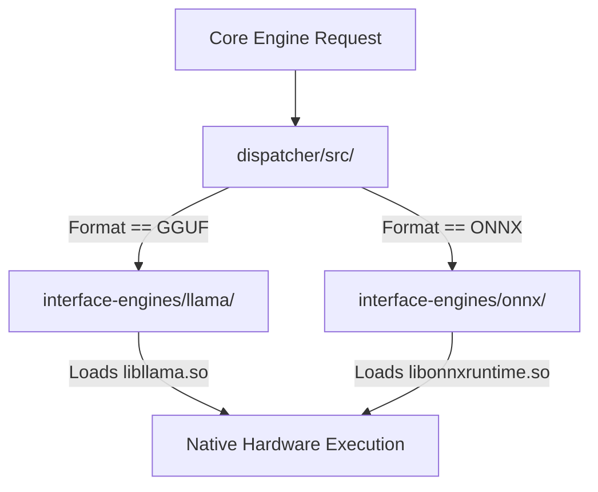

# 🚦 Backend Dispatcher (`interface-engines/dispatcher/`)

<strong>Multi-Backend Execution Router</strong>

---

## 🎯 Deep Purpose

The `dispatcher` crate acts as the central intelligence node within the `interface-engines` subsystem. The Cluaize Engine is strictly model-agnostic—it can execute `.gguf` files (using Llama.cpp) and `.onnx` files (using ONNX Runtime) seamlessly. 

However, calling C++ binaries requires highly specific setup configurations. The `dispatcher` reads the structural DNA of the requested model and dynamically routes the execution stream to the correct native backend without the outer Rust Engine needing to know which backend is executing the math.

## 🏛️ Architectural Flow

## 🧬 Significant Components

### 1. `src/` (The Routing Logic)
- **The Core Logic:** Implements the `BackendDispatcher` trait. It evaluates the model manifest (e.g., whether it is quantized to `q4_k_m` or runs on FP16) and selects the backend that has the highest physical efficiency for that format on the user's specific hardware.
- **The "Why":** A unified interface. If a new backend (like TensorRT or ExLlamaV2) is added in the future, the outer engine does not need a single line of code changed; the `dispatcher` simply gains a new routing arm.
