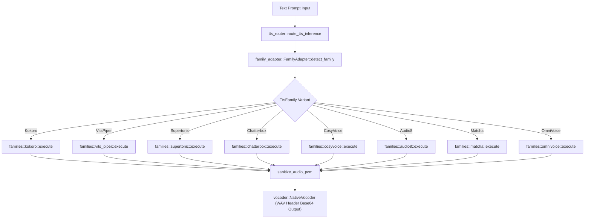

# Component: Cluaiz ONNX Audio & TTS Subsystem (`src/audio/`)

## Technical Specification
- **Purpose:** Decoupled, zero-dependency Rust audio processing engine and multi-family ONNX Text-to-Speech (TTS) orchestrator. Handles input audio decoding (Whisper ASR pipeline) and 8 distinct TTS model family topologies.
- **Platform Support:** Linux x86_64, macOS ARM64, Windows x86_64, Android AArch64.
- **Reusability Level:** Public Sovereign Subsystem Engine within `cluaiz_onnx`.

---

## Architectural Flow

---

## API Contract (Interface)

- **Core Router Entry:** `tts_router::route_tts_inference(engine, session, prompt, tokenizer) -> Result<String>`
- **Audio Sanitizer:** `tts_router::sanitize_audio_pcm(pcm: Vec<f32>) -> Result<Vec<f32>>`
- **Family Inspector:** `family_adapter::FamilyAdapter::detect_family(model_dir, sessions) -> TtsFamily`
- **Asset Gate:** `family_adapter::FamilyAdapter::validate_package_inventory(family, model_dir) -> Result<()>`
- **Export Type:** Public Rust Crate Module / C-FFI Exported via `cluaiz_onnx`.

---

## Deep File Breakdown

### A. Core Audio Subsystem (`src/audio/`)
- [`config.rs`](./config.rs):
  - **Logic:** Dynamic JSON config parser (`config.json`, `preprocessor_config.json`, `generation_config.json`).
  - **Why:** Resolves model parameters and special token IDs across Whisper and TTS pipelines.
- [`loader.rs`](./loader.rs):
  - **Logic:** Decodes audio bytes/streams via `symphonia` supporting URLs, local paths, and Base64 URIs into float32 PCM samples.
- [`spectrogram.rs`](./spectrogram.rs):
  - **Logic:** Computes bit-perfect PyTorch-aligned log-mel spectrograms for Whisper ASR.
- [`mel_bank.rs`](./mel_bank.rs):
  - **Logic:** Builds dynamic Slaney mel filterbank matrices (80 and 128 channels).
- [`decoder.rs`](./decoder.rs):
  - **Logic:** Autoregressive ONNX inference loop executing encoder-decoder transformer layers.

### B. Registered ONNX TTS Engine (`src/audio/tts/`)
- [`tts_router.rs`](./tts/tts_router.rs):
  - **Logic:** High-level router that parses prompts, chunking text into 140-char sentences, detecting family variant, validating inventory, executing model family pipeline, sanitizing PCM output, and encoding base64 WAV URIs.
- [`family_adapter.rs`](./tts/family_adapter.rs):
  - **Logic:** Pre-boot asset inventory validator and priority family detector checking `model_registry.json`, `model_manifest.json`, and ONNX session signature inputs.
- [`manifest_loader.rs`](./tts/manifest_loader.rs):
  - **Logic:** Parses manifest JSON configs to dynamically determine model sample rates (22.05kHz, 24kHz, 44.1kHz), mel channels, and token offsets.
- [`phoneme_map.rs`](./tts/phoneme_map.rs):
  - **Logic:** IPA & G2P phoneme-to-ID lookup mapper for VITS/Piper models.
- [`g2p.rs`](./tts/g2p.rs):
  - **Logic:** Rule-based and lexicon-assisted Grapheme-to-Phoneme converter.
- [`vocoder.rs`](./tts/vocoder.rs):
  - **Logic:** Native WAV encoder constructing standard PCM RIFF headers from float32 audio buffers.
- [`neural_vocoder.rs`](./tts/neural_vocoder.rs):
  - **Logic:** Executes HiFi-GAN / Vocos neural vocoder ONNX graphs converting mel-spectrogram matrices into PCM audio waveforms.

### C. 8 Model Family Handlers (`src/audio/tts/families/`)
- [`kokoro.rs`](./tts/families/kokoro.rs):
  - **Logic:** Family 2 (Kokoro-82M). Loads voice style vector `.bin` matrices (`[1, 256]`) and passes phoneme IDs through `model_uint8.onnx`.
- [`vits_piper.rs`](./tts/families/vits_piper.rs):
  - **Logic:** Family 1 (Piper/VITS). Inserts inter-phoneme zero-padding (`token 0`) for acoustic alignment and executes single-stage end-to-end variational inference.
- [`supertonic.rs`](./tts/families/supertonic.rs):
  - **Logic:** Family 3 (Supertonic-3). Runs 4-stage pipeline (Text Encoder -> Duration Predictor -> 8-step Euler ODE Denoising Loop -> Vocoder). Uses linear duration interpolation across token boundaries to eliminate 2-3x word repetition.
- [`chatterbox.rs`](./tts/families/chatterbox.rs):
  - **Logic:** Family 7 (Chatterbox Turbo). Runs 4-stage multi-codec pipeline. Uses clean reference speech embedding extraction and top-p temperature-scaled logit decoding (0.7) with repetition penalty (1.2) to eliminate static burning noise.
- [`cosyvoice.rs`](./tts/families/cosyvoice.rs):
  - **Logic:** Family 6 (CosyVoice2). Extracts speaker embeddings via `campplus.onnx` and dynamically maps all 6 required flow estimator input tensors (`prompt_token`, `prompt_speech`, `embedding`, `len`, `token_ids`) before feeding `hift.onnx` vocoder.
- [`audio8.rs`](./tts/families/audio8.rs):
  - **Logic:** Family 4 (Audio8 Codec-LM). Executes 3-stage pipeline (Slow AR -> Fast AR -> Codec Decoder). Expands coarse tokens into 10-codebooks 3D array `[1, 10, frames]` matching DAC neural vocoder contract.
- [`matcha.rs`](./tts/families/matcha.rs):
  - **Logic:** Family 5 (Matcha/LuxTTS). Executes 2-stage flow matching pipeline (`text_encoder_int8` -> `fm_decoder_int8` ODE loop -> `vocos.bin` / neural vocoder). Uses rank-1 unit slice tensor mapping for ORT scalar inputs.
- [`omnivoice.rs`](./tts/families/omnivoice.rs):
  - **Logic:** Family 8 (OmniVoice GenAI). Executes multi-head audio decoder (`audio_embeddings_encoder` -> 28-layer `llm_decoder` KV-cache -> `audio_heads_decoder` -> 8-codebook argmax decoding).

---

## Failure & Recovery Logic
- **Invalid Output PCM Buffer:** `sanitize_audio_pcm` checks generated float32 samples for `NaN` or `Infinite` values and aborts synthesis to prevent speaker buzzing/clipping damage.
- **Low Signal Noise Amplification:** If max amplitude is below `0.01`, peak scaling is skipped to avoid multiplying background neural floating-point noise into blowing air sound ("fhoor fhoor").
- **Asset Inventory Failure:** `validate_package_inventory` checks required ONNX sub-components before allocating GPU/RAM session memory and returns `PackageContractException`.

